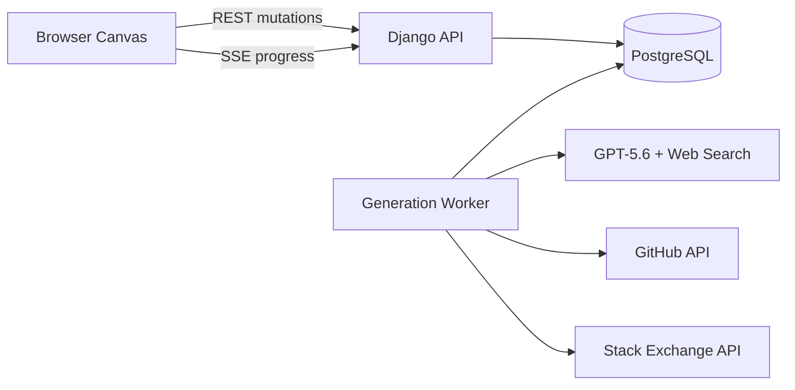
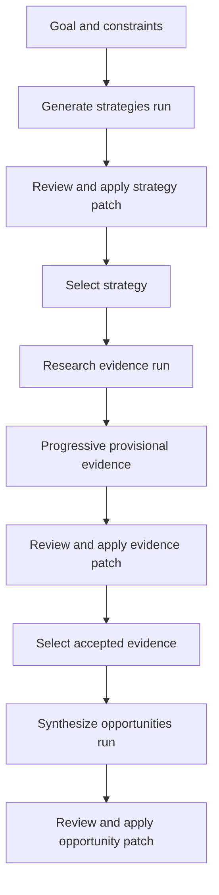

# Evidence-Native Opportunity Canvas
## Product and System Design Document

**Status:** Architecture frozen; implementation-ready draft  
**Document type:** Product and technical design  
**Target:** OpenAI Build Week hackathon MVP  
**Primary track:** Work & Productivity  
**Primary user:** Technical founder or product builder  
**Last updated:** July 15, 2026
**Author:** Daniel Pittaluga

---

## 1. Executive Summary

Evidence-Native Opportunity Canvas is a graph-native ideation system that helps technical founders turn vague goals, constraints, and public market signals into credible software business opportunities.

The system does not ask the model to invent startup ideas from a blank prompt. Instead, it:

1. Generates high-leverage opportunity strategies.
2. Researches observable market evidence.
3. Converts sources into structured claims.
4. Synthesizes specific opportunity candidates.
5. Critiques those candidates for novelty, feasibility, evidence strength, and builder fit.
6. Produces a graph patch that the user can inspect and apply.

The product is intentionally designed as a graph rather than a chat interface. Users can select multiple nodes, generate descendants, trace provenance, reject evidence, branch ideas under different constraints, and regenerate only affected downstream nodes.

The hackathon architecture favors application-layer correctness over infrastructure breadth:

- Django backend
- PostgreSQL for graph state, durable jobs, events, and patches
- PostgreSQL `SKIP LOCKED` queue
- Separate worker process
- Server-Sent Events for progress
- Optimistic entity versioning
- Short database transactions
- Fenced worker leases
- GPT-5.6 with web search and structured outputs
- Ports-and-adapters execution profiles for live, hybrid-demo, and replay modes
- Cascade invalidation instead of automatic descendant regeneration
- Resumable stage checkpoints keyed by semantic input and provider identity
- Bounded worker lifetimes and graceful process recycling
- No Redis, Celery, Neo4j, or WebSockets in the MVP

---

## 2. Product Thesis

### 2.1 Core problem

Most AI brainstorming tools produce plausible prose but weak decisions. They lack:

- Evidence
- Provenance
- Contradicting signals
- Builder-specific constraints
- Explicit opportunity mechanisms
- Regeneration semantics
- A durable model of how ideas evolved

The result is often an attractive but unsupported concept.

### 2.2 Product proposition

> Turn observable market signals into specific, testable software opportunities.

The system should answer:

> Where is there already strong evidence that a product should exist, and what product could this particular builder realistically create?

### 2.3 Core differentiation

The product is not a mind map with an AI button. Its differentiated layer is:

- Typed graph objects
- Opportunity-strategy templates
- Evidence extraction and classification
- Multi-node transformations
- Provenance-aware generation
- Contradiction handling
- Builder-fit constraints
- Branching and partial regeneration
- Structured graph patches rather than prose replacement

---

## 3. Goals and Non-Goals

### 3.1 MVP goals

The MVP must allow a user to:

1. Create a canvas.
2. Add a goal and builder constraints.
3. Generate exactly three distinct opportunity strategies.
4. Select one strategy and research evidence.
5. Inspect source-backed evidence claims.
6. Select evidence and generate opportunity candidates.
7. Inspect assumptions, contradictions, risks, and validation experiments.
8. Accept or reject generated graph patches.
9. Change or remove a premise and regenerate only dependent descendants.
10. Save and reload the canvas.
11. Complete the canonical workflow without private setup.

### 3.2 Non-goals

The MVP will not include:

- Real-time multi-user collaboration
- Mobile-first canvas editing
- Arbitrary ontology design
- Full market sizing
- Financial forecasting
- Autonomous research lasting several minutes
- Dozens of data connectors
- Team permissions
- Neo4j or another graph database
- Redis or Celery
- WebSocket-based collaboration
- Comprehensive venture diligence
- Production-grade billing
- Long-term semantic memory across all canvases

---

## 4. Target User and Terminal Outcome

### 4.1 Target user

A technical founder or product builder who:

- Can build software
- Has limited capital
- Needs a credible opportunity rather than generic inspiration
- Wants to reason through evidence and constraints
- Is willing to validate before committing to implementation

### 4.2 Terminal artifact

A completed opportunity node must contain:

- Buyer
- Problem
- Existing spend or workaround
- Product mechanism
- Business model
- Why now
- Supporting evidence
- Contradicting evidence
- Critical assumptions
- Main risks
- Validation experiment
- Builder-fit rationale

The canvas is a means to produce this artifact, not an end in itself.

---

## 5. Canonical User Journey

### 5.1 Input

The user enters:

> Find a recurring-revenue software opportunity for a solo Python developer.

Constraint nodes:

- Skills: Python, Django, backend systems
- Team size: one
- Capital: low
- Time to MVP: eight weeks
- Preferred model: B2B subscription
- Operational tolerance: low
- Sales preference: self-service

### 5.2 Strategy generation

The system creates:

- Repackage validated demand
- Productize recurring service work
- Commercialize an open-source workflow

### 5.3 Evidence research

The user selects `Productize recurring service work` and clicks **Find evidence**.

The system researches:

- Public service pricing
- Repeated manual workflow descriptions
- Job postings
- Technical discussions
- Existing workaround tools
- Customer complaints

Validated extraction batches appear progressively as provisional source and claim nodes. When research completes, the user reviews and applies the evidence patch, rejects any unsuitable evidence, and selects accepted claim nodes for synthesis; their accepted source provenance is included automatically.

### 5.4 Opportunity synthesis

The user starts a separate synthesis run from the selected accepted evidence.

The system generates:

> Automated security questionnaire workspace for small SaaS vendors.

The opportunity is supported by:

- Evidence that companies pay consultants for questionnaire completion
- Repeated complaints about manual document reuse
- Publicly observable recurrence of vendor-security reviews
- Existing but overbuilt enterprise solutions

### 5.5 Critique

The system adds:

- Risk: Enterprise incumbents may move downmarket
- Contradiction: Some customers may prefer services over software
- Assumption: Small SaaS vendors complete enough questionnaires to justify subscription pricing
- Validation: Interview ten SaaS security leads and request three paid design-partner commitments

---

## 6. Opportunity Strategy Ontology

The model should not invent strategy mechanisms from scratch on every run. The system starts with curated strategy templates and allows GPT-5.6 to adapt or combine them.

### 6.1 Initial strategies

1. Repackage validated demand
2. Productize recurring service work
3. Replace a critical spreadsheet
4. Unbundle a valuable feature
5. Rebundle a fragmented workflow
6. Commercialize an open-source project
7. Move an enterprise capability downmarket
8. Automate mandatory work
9. Prevent an expensive failure
10. Remove a scarce-expert bottleneck
11. Exploit a disliked pricing model
12. Build infrastructure around a growing ecosystem
13. Convert operational data into decisions
14. Turn a marketplace participant workflow into SaaS

### 6.2 Strategy schema

```json
{
  "id": "productize_recurring_service",
  "title": "Productize recurring service work",
  "description": "Convert a repeated, expensive service workflow into software.",
  "required_signals": [
    "customers already pay for the outcome",
    "the workflow repeats",
    "inputs and outputs are partially structured"
  ],
  "failure_conditions": [
    "most work requires bespoke expert judgment",
    "delivery depends primarily on local physical labor"
  ],
  "default_research_queries": [
    "service pricing",
    "manual workflow",
    "consulting package",
    "spreadsheet template",
    "job description"
  ]
}
```

---

## 7. Quality Contract

“Brilliant” must be operationalized rather than left to model taste.

### 7.1 Required dimensions

| Dimension | Definition |
|---|---|
| Economic leverage | Converts existing revenue, labor, obligation, data, distribution, or infrastructure into a product opportunity |
| Evidence strength | Supported by independent observations |
| Novelty | Uses a meaningful transformation, not only “X with AI” |
| Specificity | Identifies buyer, problem, mechanism, and business model |
| Builder fit | Matches the user’s skills, capital, timeline, and operating preferences |
| Technical feasibility | Can plausibly be built and operated |
| Distribution clarity | Provides a credible path to reach buyers |
| Defensibility | Explains why the opportunity is not immediately erased |
| Testability | Includes a cheap falsifiable validation experiment |
| Honesty | Separates observation, derivation, and inference |

### 7.2 Separate dimensions, not one score

Do not collapse all quality dimensions into a single synthetic score.

Display separately:

- Evidence strength
- Novelty
- Builder fit
- Technical feasibility
- Distribution clarity
- Operational burden

This avoids false precision and lets users choose their preferred risk profile.

The strict opportunity payload stores the explanation behind those dimensions rather than only numeric or ordinal ratings. It includes `distribution_channel`, `distribution_rationale`, `defensibility`, `technical_feasibility`, and `operational_burden` alongside the buyer, problem, current spend or workaround, mechanism, business model, evidence, contradiction, assumptions, risks, validation experiment, and builder fit. The UI renders the six listed dimensions separately and never substitutes one aggregate score.

### 7.3 Support threshold

An opportunity may be labeled `supported` only when it includes:

- One spending, revenue, or labor-cost signal
- Two independent demand or pain signals
- One identifiable buyer
- One plausible distribution channel
- One material contradiction or risk
- One validation experiment

Otherwise it is labeled `speculative`.

The support-threshold validator evaluates the structured distribution fields and the underlying accepted evidence. A distribution-clarity score without an identified channel does not satisfy the threshold, and a defensibility rating without its rationale is invalid structured output.

---

## 8. Evidence Model

### 8.1 Source versus claim

A source and a claim are separate entities.

One source can support multiple claims. One claim can be supported by multiple sources.

```text
Source: Pricing page
  ├── supports → Minimum plan is $299/month
  └── supports → Pricing is per seat

Source: User discussion
  └── supports → Small teams perceive pricing as expensive
```

### 8.2 Evidence classifications

- `observed`: directly present in a source
- `derived`: calculated from source data
- `inferred`: model interpretation
- `contradicting`: evidence against the opportunity

### 8.2.1 Evidence rejection semantics

Evidence rejection is an authoritative user action, not a visual-only preference.

When a source or claim is rejected:

- The node remains in the graph operation history for auditability.
- Its semantic metadata records `review_status: rejected` and the rejecting operation.
- It is excluded from future context packing, support-threshold calculations, synthesis, and critique.
- Accepted descendants that depended on it are marked stale through the normal transitive invalidation rules.
- Rejecting a source rejects claims supported only by that source; claims with other accepted independent sources remain eligible but lose the rejected source from their support calculation.

Rejected evidence remains visible by default as a muted node under DQ-002. The canvas uses a persistent text badge and accessible status in addition to reduced visual emphasis; color or opacity alone never communicates rejection. Rejected source and claim nodes remain keyboard-focusable and inspectable for their audit history, but generation selection controls exclude them and explain why. This presentation does not change the fixed rejection, support, context-exclusion, or invalidation semantics.

Evidence rejection is one short graph transaction. It locks the canvas first, validates the evidence semantic version, records the rejection operation, updates support eligibility, marks newly affected descendants stale, writes every staleness cause, and increments the canvas revision together. A failure rolls back all of those effects; no intermediate state may expose rejected evidence with accepted dependent claims or missing stale markers.

### 8.3 Source hierarchy

1. Official pricing, filings, documentation
2. Structured public APIs
3. Reputable reporting and case studies
4. Marketplace listings
5. Technical discussions and forums
6. Anonymous individual comments

Authority is derived from source identity rather than keywords in an arbitrary URL. Government and educational publishers, plus first-party vendor documentation, API, pricing, legal, security, support, terms, and trust surfaces, qualify for rank 1 only when normalized publisher identity plus host/title evidence proves that first-party relationship. A generic path word such as `pricing`, `docs`, or `security` is never sufficient by itself. GitHub discussions and Stack Exchange questions retain their discussion/forum hierarchy regardless of repository or path names. User-supplied URLs use the same classifier as retrieved web results rather than receiving an unconditional rank. Third-party commentary that merely mentions pricing, documentation, or a vendor does not.

### 8.4 MVP evidence sources

Required:

- OpenAI hosted web search
- GitHub public API
- Stack Exchange API
- User-supplied URLs or text

Optional stretch sources:

- Hacker News search
- SEC filings

Avoid in MVP:

- Reddit API
- LinkedIn
- G2 scraping
- Capterra scraping
- Crunchbase
- Unofficial Google Trends clients
- Product Hunt OAuth
- Arbitrary headless-browser crawling

### 8.5 Claim schema

```json
{
  "id": "claim_123",
  "claim": "Small teams find the product operationally complex.",
  "classification": "observed",
  "evidence_type": "customer_pain",
  "topic_keys": ["vendor_security_review"],
  "mechanism_tags": ["automate_mandatory_work"],
  "contradiction_target_key": null,
  "strength": "medium",
  "limitations": [
    "Single discussion thread",
    "Segment may not be representative"
  ],
  "source_ids": ["source_1", "source_9"]
}
```

Extraction emits sorted, deduplicated `topic_keys` and `mechanism_tags` as normalized lowercase slugs. `mechanism_tags` use the versioned opportunity-strategy vocabulary where applicable. `contradiction_target_key` is either null or a stable graph/entity or normalized mechanism key identifying what a contradicting claim challenges; it is available before graph-patch construction and participates in deterministic clustering.

Extraction also emits the sorted, deduplicated ID set of every candidate claim considered and a typed rejected-evidence ledger whose entries identify either a `source` or a `claim`. Retained and rejected claim IDs exactly partition that candidate set. Every researched source is likewise either retained exactly once or explicitly rejected, and rejected source IDs must come from the immediately preceding research checkpoint. The audit envelope is bounded at ten source identities and one hundred candidate claim identities; deterministic retention still caps the retained claim set at twelve.

### 8.6 Source schema

```json
{
  "id": "source_1",
  "kind": "web",
  "url": "https://example.com/pricing",
  "title": "Example pricing",
  "retrieved_at": "2026-07-13T20:15:00Z",
  "content_hash": "sha256:...",
  "independence_key": "publisher:example.com",
  "metadata": {
    "domain": "example.com",
    "authoritative": true
  }
}
```

`independence_key` belongs to the source or originating dataset, not to the claim. A claim may reference many sources, and its independent-support count is the number of distinct accepted source `independence_key` values among those references. Web publisher identity is the registrable domain, so `www.example.com` and `docs.example.com` do not count independently. Sources with identical retained-content hashes from different publishers are normalized to one mirror identity within the bounded research result. Syndicated or mirrored sources therefore share one key and count once. Claim-source references and their accepted/rejected state are the canonical support relation; denormalized `source_ids` in structured output must be validated against those relations when graph operations are constructed.

---

## 9. Graph Domain Model

### 9.1 Node kinds

The MVP supports:

- `goal`
- `constraint`
- `strategy`
- `source`
- `claim`
- `opportunity`
- `assumption`
- `risk`
- `validation_experiment`
- `generation_placeholder`

### 9.2 Edge kinds

- `supports`
- `contradicts`
- `derived_from`
- `constrained_by`
- `evolves_into`
- `requires_validation`
- `extracted_from`

### 9.2.1 Dependency direction and invalidation

Dependency traversal uses semantic direction, which is not always the stored edge direction:

| Edge kind | Stored source → target meaning | Invalidation direction |
|---|---|---|
| `supports` | Evidence supports a claim or opportunity | source → target |
| `contradicts` | Evidence contradicts a claim or opportunity | source → target |
| `derived_from` | Upstream premise evolves into a derived node | source → target |
| `evolves_into` | Earlier node evolves into a later node | source → target |
| `requires_validation` | Premise requires a validation experiment | source → target |
| `constrained_by` | Candidate is constrained by a constraint node | target → source |
| `extracted_from` | Claim is extracted from a source node | target → source |

Editing, deleting, rejecting, or disconnecting an upstream node or dependency edge marks every reachable dependent node stale in this direction. Edge deletion uses the persisted pre-delete relationship; an edge kind or endpoint change evaluates both its pre-mutation and post-mutation dependency relationships. Traversal is breadth-first with a visited set, so converging paths and accidental cycles terminate deterministically. The changed origin is never marked stale by a cycle back-edge. Provenance/context traversal uses the inverse relation when walking from a selected node to its semantic ancestors.

Staleness is durable lifecycle state, not an arbitrary metadata flag. Each node has a queryable `stale` flag and zero or more append-only cause records tied to the graph operation that invalidated it. The first fresh-to-stale transition increments the node semantic version exactly once, updates `semantic_updated_at`, and invalidates its token representation; adding another cause to an already stale node does not increment the version again. Propagation is computed once from the originating mutation and writes causes without recursively treating the system-generated stale transitions as new invalidation origins.

The MVP always applies stale regeneration as a parallel branch under DQ-004. Old production-unit nodes and every active cause remain unchanged and stale; fresh successor nodes receive new identities. Each successor production root records the old root in canonical `regenerated_from_node_id` metadata and is linked by an audited `evolves_into` edge from old to new. `permitted_stale_resolution_ids` remains an immutable workset fence and audit declaration, but Phase 4 application clears zero old-node causes. Manual edits and reversal of the original premise never silently clear staleness. Deleting a stale node removes its active cause rows while the graph-operation audit remains. Destructive replacement is outside the MVP.

### 9.3 Node structure

```json
{
  "id": "node_123",
  "canvas_id": "canvas_1",
  "kind": "opportunity",
  "title": "Managed Django Fleet",
  "body": "A fixed-price operations platform...",
  "metadata": {
    "buyer": "Web development agencies",
    "business_model": "Per-application subscription",
    "status": "supported"
  },
  "position": {
    "x": 812,
    "y": 405
  },
  "stale": false,
  "stale_since_revision": null,
  "version": 3,
  "position_version": 7,
  "context_token_count": 147
}
```

`version` is the semantic version used by generation requests and graph-patch preconditions. `position_version` protects layout-only updates. `MOVE_NODE` requires `expected_position_version`, increments only `position_version`, and still appends a graph operation and increments the canvas revision. Semantic mutations require `expected_version`, increment `version`, and invalidate the cached semantic token representation. Layout changes therefore do not invalidate generation context or conflict with semantic patch updates.

Constraint nodes use semantic metadata `context_scope: global | branch` and `pinned: boolean`. A branch-scoped constraint also has a relational `branch_root_node_id` pointing to exactly one same-canvas `strategy`, `claim`, or `opportunity` root. Global constraints require a null branch root; branch-scoped constraints require a non-null root. A pinned global constraint is automatically included in every compatible operation. A pinned branch constraint is automatically included only when the operation has at least one mandatory generated-node selection and every such selection is its root or a reachable dependent of that root. Unpinned constraints enter context only through explicit selection or normal graph-neighborhood traversal.

Pinning, unpinning, changing scope, or reanchoring a branch constraint is an audited semantic mutation with an `expected_version` precondition. A branch root cannot be deleted while constraints reference it; the conflict reports those constraint IDs so the user can delete, reanchor, or change their scope first. Under the always-parallel DQ-004 policy, regeneration preserves every old anchor and proposes a fresh clone of each applicable branch-scoped constraint anchored to the corresponding successor production root. The clone and its new root are dependency-linked candidate operations, so partial review cannot apply an orphaned branch constraint.

### 9.4 Graph-native requirements

The graph must support behavior that a chat transcript cannot provide:

- Multi-node synthesis
- Provenance tracing
- Branch comparison
- Dependency-aware invalidation and explicit regeneration
- Evidence rejection
- Assumption replacement
- Descendant invalidation
- Partial patch acceptance

---

## 10. High-Level Architecture



### 10.1 Runtime components

- Web application process
- Generation worker process
- PostgreSQL

No additional infrastructure is required for the MVP.

---

## 11. Frontend-Backend State Contract

### 11.1 Current-state model plus operation log

The system is not fully event-sourced.

It uses:

1. Relational current-state tables
2. Append-only graph operations
3. Generated patches requiring explicit user acceptance

### 11.2 API mutation model

The frontend sends localized operations, not complete graph snapshots.

Examples:

- `ADD_NODE`
- `UPDATE_NODE`
- `DELETE_NODE`
- `ADD_EDGE`
- `UPDATE_EDGE`
- `DELETE_EDGE`
- `PATCH_NODE_METADATA`
- `MOVE_NODE`

Every direct mutation includes a client-generated `operation_key`. Semantic node operations carry `expected_version`; `MOVE_NODE` carries `expected_position_version`; edge updates/deletes carry the edge `expected_version`. The server stores a request fingerprint with the operation key so network retries are idempotent without accepting conflicting reuse. Every transaction that mutates canvas graph state locks the canvas row before entity rows, appends its graph operation, and advances the canvas revision. Run creation uses the same canvas lock order so its automatically selected context cannot straddle two semantic revisions.

Every direct semantic update applies a per-node-kind field allowlist; `UPDATE_NODE` cannot smuggle unrestricted metadata around `PATCH_NODE_METADATA`. User-writable fields include authored title/body/descriptive fields and, for constraint nodes only, validated `context_scope` and `pinned` changes. `UPDATE_NODE` may change the relational `branch_root_node_id` only as part of the same validated constraint scope/anchor workflow. Review status, supported/speculative classification, stale lifecycle fields and causes, source identity, generated provenance, and regeneration lineage are server-owned. They may change only through their dedicated validated workflow or an accepted server-generated patch. Unknown or wrong-kind fields return `422`; attempts to write server-owned fields return `403` and create no graph operation.

`DELETE_NODE` never silently cascades. If incident edges or branch-scoped constraint references exist, the server returns `409 Conflict` with their IDs and current versions. The client must delete the edges and delete, reanchor, or rescope the constraints through audited operations before retrying the node deletion. A graph patch that deletes a node must likewise contain accepted prerequisite operations for every incident edge and branch-root reference; a dependency added concurrently remains a conflict. This keeps every removal visible in the operation log and preserves optimistic concurrency.

### 11.3 Graph patch principle

The AI never writes directly to the authoritative graph.

It produces a candidate `GraphPatch`.

```json
{
  "base_canvas_revision": 47,
  "operations": [
    {
      "op": "ADD_NODE",
      "client_generated_id": "candidate_1",
      "node": {
        "kind": "opportunity",
        "title": "Managed Django Fleet"
      }
    },
    {
      "op": "ADD_EDGE",
      "source": "node_14",
      "target": "candidate_1",
      "kind": "derived_from"
    }
  ]
}
```

Every `client_generated_id` must be unique within the patch. An operation may reference an existing entity UUID or a prior client-generated ID. Patch validation builds an operation dependency graph, rejects missing or forward-incompatible references, and requires a selected partial-acceptance subset to include every prerequisite operation.

While holding the patch lock during apply, the server allocates UUIDs for accepted client-generated IDs and persists the resulting `client_id_map` in the same transaction as graph writes. Later operations resolve through that map, and the apply response returns it. Idempotent retries return the persisted map rather than allocating new identities.

---

## 12. Persistence Model

### 12.1 Canvas

```sql
CREATE TABLE canvas (
    id uuid PRIMARY KEY,
    title text NOT NULL,
    revision bigint NOT NULL DEFAULT 0,
    created_at timestamptz NOT NULL,
    updated_at timestamptz NOT NULL
);
```

### 12.2 Node

```sql
CREATE TABLE node (
    id uuid PRIMARY KEY,
    canvas_id uuid NOT NULL REFERENCES canvas(id),
    kind text NOT NULL,
    title text NOT NULL,
    body text,
    metadata jsonb NOT NULL DEFAULT '{}',
    branch_root_node_id uuid,
    position jsonb NOT NULL DEFAULT '{}',
    stale boolean NOT NULL DEFAULT false,
    stale_since_revision bigint,
    version bigint NOT NULL DEFAULT 1,
    position_version bigint NOT NULL DEFAULT 1,
    context_token_count integer,
    context_representation_version integer NOT NULL DEFAULT 1,
    context_content_hash text,
    created_at timestamptz NOT NULL,
    semantic_updated_at timestamptz NOT NULL,
    position_updated_at timestamptz NOT NULL,
    updated_at timestamptz NOT NULL,
    UNIQUE (id, canvas_id),
    FOREIGN KEY (branch_root_node_id, canvas_id) REFERENCES node(id, canvas_id),
    CHECK ((stale = false AND stale_since_revision IS NULL) OR (stale = true AND stale_since_revision IS NOT NULL))
);
```

Semantic node mutations update `semantic_updated_at` and `updated_at`. `MOVE_NODE` updates `position_updated_at` and `updated_at` but never `semantic_updated_at`. Context ranking and semantic input hashes use `semantic_updated_at`; position timestamps and versions never participate in semantic generation inputs. A database constraint trigger or equivalent same-transaction invariant validates branch-root kind, scope, and same-canvas ownership; application validation alone is insufficient.

### 12.3 Edge

```sql
CREATE TABLE edge (
    id uuid PRIMARY KEY,
    canvas_id uuid NOT NULL REFERENCES canvas(id),
    source_node_id uuid NOT NULL,
    target_node_id uuid NOT NULL,
    kind text NOT NULL,
    metadata jsonb NOT NULL DEFAULT '{}',
    version bigint NOT NULL DEFAULT 1,
    created_at timestamptz NOT NULL,
    updated_at timestamptz NOT NULL,
    FOREIGN KEY (source_node_id, canvas_id) REFERENCES node(id, canvas_id),
    FOREIGN KEY (target_node_id, canvas_id) REFERENCES node(id, canvas_id)
);
```

### 12.4 Graph operation

```sql
CREATE TABLE graph_operation (
    id bigint GENERATED ALWAYS AS IDENTITY PRIMARY KEY,
    canvas_id uuid NOT NULL REFERENCES canvas(id),
    actor_type text NOT NULL,
    actor_id text,
    operation_key text NOT NULL,
    request_fingerprint text NOT NULL,
    operation_type text NOT NULL,
    payload jsonb NOT NULL,
    result_payload jsonb NOT NULL,
    canvas_revision bigint NOT NULL,
    created_at timestamptz NOT NULL,
    UNIQUE (id, canvas_id),
    UNIQUE (canvas_id, actor_type, operation_key)
);
```

For direct API mutations, `operation_key` is a client-generated UUID. `payload` stores the canonical request and `result_payload` stores created entity IDs and resulting versions needed to reproduce the response. Replaying the same key with the same fingerprint returns that original result; reusing it with different content returns `409 Conflict`. Patch application derives a deterministic key from patch ID and operation index.

### 12.4.1 Node staleness causes

```sql
CREATE TABLE node_staleness_cause (
    id bigint GENERATED ALWAYS AS IDENTITY PRIMARY KEY,
    canvas_id uuid NOT NULL REFERENCES canvas(id),
    node_id uuid NOT NULL,
    cause_graph_operation_id bigint NOT NULL,
    origin_entity_type text NOT NULL,
    origin_entity_id uuid NOT NULL,
    created_at timestamptz NOT NULL,
    cleared_by_graph_operation_id bigint,
    cleared_at timestamptz,
    UNIQUE (id, canvas_id),
    UNIQUE (node_id, cause_graph_operation_id),
    FOREIGN KEY (node_id, canvas_id) REFERENCES node(id, canvas_id) ON DELETE CASCADE,
    FOREIGN KEY (cause_graph_operation_id, canvas_id) REFERENCES graph_operation(id, canvas_id),
    FOREIGN KEY (cleared_by_graph_operation_id, canvas_id) REFERENCES graph_operation(id, canvas_id),
    CHECK ((cleared_by_graph_operation_id IS NULL) = (cleared_at IS NULL))
);
```

An active cause has null clearing fields. `node.stale` is true exactly when at least one active cause exists, except that parallel regeneration intentionally leaves old-node causes active while creating fresh successor nodes. The cause stores the origin identifier as audit data without a foreign key because the invalidating node or edge may be explicitly deleted in the same operation.

### 12.5 Generation run

```sql
CREATE TABLE generation_run (
    id uuid PRIMARY KEY,
    canvas_id uuid NOT NULL REFERENCES canvas(id),
    operation text NOT NULL,
    idempotency_key text NOT NULL,
    request_fingerprint text NOT NULL,
    status text NOT NULL,
    current_stage text,
    base_canvas_revision bigint NOT NULL,
    context_snapshot jsonb NOT NULL,
    context_manifest jsonb NOT NULL,
    context_hash text NOT NULL,
    selected_node_ids jsonb NOT NULL,
    expected_node_versions jsonb NOT NULL,
    execution_configuration jsonb NOT NULL,
    worker_id text,
    lease_token uuid,
    lease_epoch bigint NOT NULL DEFAULT 0,
    attempt integer NOT NULL DEFAULT 0,
    max_attempts integer NOT NULL DEFAULT 3,
    heartbeat_at timestamptz,
    lease_expires_at timestamptz,
    cancel_requested_at timestamptz,
    error jsonb,
    created_at timestamptz NOT NULL,
    started_at timestamptz,
    completed_at timestamptz,
    UNIQUE (id, canvas_id),
    UNIQUE (canvas_id, idempotency_key)
);
```

### 12.6 Generation stage

```sql
CREATE TABLE generation_stage (
    id uuid PRIMARY KEY,
    run_id uuid NOT NULL REFERENCES generation_run(id),
    name text NOT NULL,
    input_hash text NOT NULL,
    status text NOT NULL,
    attempt integer NOT NULL DEFAULT 0,
    openai_response_id text,
    output jsonb,
    error jsonb,
    started_at timestamptz,
    completed_at timestamptz,
    UNIQUE (run_id, name, input_hash)
);
```

### 12.7 Canvas event cursor

Canvas-scoped SSE replay requires one monotonic cursor shared by every run on the canvas.

```sql
CREATE TABLE canvas_event_cursor (
    canvas_id uuid PRIMARY KEY REFERENCES canvas(id),
    last_sequence bigint NOT NULL DEFAULT 0
);
```

The cursor row is created atomically with every new canvas. The migration that introduces this table backfills exactly one row for every existing canvas. Event append increments `last_sequence` and inserts the event in the same short transaction. This serializes event numbering per canvas without locking the canvas graph-state row.

### 12.8 Generation event

```sql
CREATE TABLE generation_event (
    id bigint GENERATED ALWAYS AS IDENTITY PRIMARY KEY,
    canvas_id uuid NOT NULL REFERENCES canvas(id),
    run_id uuid NOT NULL,
    canvas_sequence bigint NOT NULL,
    run_sequence bigint NOT NULL,
    event_type text NOT NULL,
    payload jsonb NOT NULL,
    created_at timestamptz NOT NULL,
    FOREIGN KEY (run_id, canvas_id) REFERENCES generation_run(id, canvas_id),
    UNIQUE (canvas_id, canvas_sequence),
    UNIQUE (run_id, run_sequence)
);
```

`canvas_sequence` is the SSE replay cursor. `run_sequence` preserves ordering within one run for diagnostics and validation.

### 12.9 Graph patch

```sql
CREATE TABLE graph_patch (
    id uuid PRIMARY KEY,
    run_id uuid NOT NULL,
    canvas_id uuid NOT NULL REFERENCES canvas(id),
    base_canvas_revision bigint NOT NULL,
    operations jsonb NOT NULL,
    regeneration_target_ids jsonb NOT NULL DEFAULT '[]',
    permitted_stale_resolution_ids jsonb NOT NULL DEFAULT '[]',
    client_id_map jsonb NOT NULL DEFAULT '{}',
    status text NOT NULL,
    regenerated_by_run_id uuid,
    created_at timestamptz NOT NULL,
    decided_at timestamptz,
    applied_at timestamptz,
    FOREIGN KEY (run_id, canvas_id) REFERENCES generation_run(id, canvas_id),
    FOREIGN KEY (regenerated_by_run_id, canvas_id) REFERENCES generation_run(id, canvas_id),
    UNIQUE (id, canvas_id),
    UNIQUE (run_id)
);
```

Allowed patch statuses are `pending`, `applied`, `partially_applied`, and `rejected`.

For a non-regeneration patch, both regeneration arrays are empty. A Phase 3 regeneration patch persists the complete frozen production-unit IDs in `regeneration_target_ids` and the complete stale member IDs fenced by `permitted_stale_resolution_ids`. These fields are immutable candidate-patch declarations, not an instruction to clear staleness. Under the always-parallel DQ-004 policy, PG-023 validates the declarations but clears none of the old-node causes; it creates fresh successors, explicit old-to-new lineage, and any required cloned branch constraints.

### 12.10 Graph patch operation decision

Partial acceptance and auditability require an explicit decision for every reviewed candidate operation.

```sql
CREATE TABLE graph_patch_operation_decision (
    id uuid PRIMARY KEY,
    patch_id uuid NOT NULL,
    canvas_id uuid NOT NULL REFERENCES canvas(id),
    operation_index integer NOT NULL,
    decision text NOT NULL,
    reason text,
    actor_type text NOT NULL,
    actor_id text,
    graph_operation_id bigint,
    decided_at timestamptz NOT NULL,
    FOREIGN KEY (patch_id, canvas_id) REFERENCES graph_patch(id, canvas_id),
    FOREIGN KEY (graph_operation_id, canvas_id) REFERENCES graph_operation(id, canvas_id),
    UNIQUE (patch_id, operation_index)
);
```

Allowed operation decisions are `accepted`, `rejected`, and `skipped_conflict`. `graph_operation_id` is populated only when the candidate operation is applied. A full rejection records `rejected` for every candidate operation; a nonconflicting apply records `skipped_conflict` for operations that fail preconditions.

Every table that duplicates `canvas_id` with a parent identifier enforces that pair through a composite foreign key or an equivalent database constraint; application checks alone are insufficient. Canvas deletion follows DQ-003 and is verified as one lifecycle operation across graph state, runs, stages, cursor/events, patches/decisions, source-ingestion reservations, and caches. Phase 1 deletion covers the tables then present; each later migration extends the same deletion test before it can ship.

### 12.11 Research caches

Search-result and retrieved-content caching are separate because a current content hash is not known before retrieval.

```sql
CREATE TABLE research_query_cache (
    id uuid PRIMARY KEY,
    canvas_id uuid NOT NULL REFERENCES canvas(id),
    normalized_query text NOT NULL,
    provider_identity text NOT NULL,
    strategy_version text NOT NULL,
    prompt_version text NOT NULL,
    context_hash text NOT NULL,
    result jsonb NOT NULL,
    retrieved_at timestamptz NOT NULL,
    fresh_until timestamptz NOT NULL,
    expires_at timestamptz NOT NULL,
    UNIQUE (canvas_id, normalized_query, provider_identity, strategy_version, prompt_version, context_hash)
);

CREATE TABLE source_content_cache (
    id uuid PRIMARY KEY,
    canvas_id uuid NOT NULL REFERENCES canvas(id),
    normalized_url text NOT NULL,
    content_hash text NOT NULL,
    retained_content text,
    retrieval_metadata jsonb NOT NULL,
    retrieved_at timestamptz NOT NULL,
    fresh_until timestamptz NOT NULL,
    expires_at timestamptz NOT NULL,
    UNIQUE (canvas_id, normalized_url, content_hash)
);
```

Both tables have indexes supporting lookup of an unexpired entry by canvas and known pre-request fields. Under DQ-003, cache rows expire and are physically removed after 24 hours, and `source_content_cache.retained_content` remains null; the row retains only source identity and retrieval metadata.

### 12.12 Source ingestion reservation

```sql
CREATE TABLE source_ingestion_request (
    id uuid PRIMARY KEY,
    canvas_id uuid NOT NULL REFERENCES canvas(id),
    operation_key text NOT NULL,
    request_fingerprint text NOT NULL,
    status text NOT NULL CHECK (status IN ('running', 'completed', 'failed')),
    worker_id text,
    lease_token uuid,
    lease_epoch bigint NOT NULL DEFAULT 0,
    lease_expires_at timestamptz,
    result_source_node_id uuid,
    error jsonb,
    created_at timestamptz NOT NULL,
    updated_at timestamptz NOT NULL,
    FOREIGN KEY (result_source_node_id, canvas_id) REFERENCES node(id, canvas_id),
    UNIQUE (canvas_id, operation_key)
);
```

The first request creates a `running` reservation in a short transaction, performs retrieval outside a transaction, and finalizes it as `completed` with the source node plus audited graph operation in a second short transaction. A terminal structured retrieval failure records `failed`. An identical completed retry returns the stored source result; conflicting key reuse returns `409`; an identical in-flight retry returns `202` with the ingestion ID. A running reservation whose lease outlives the bounded retrieval window may be reclaimed with a new lease, using the same fencing rules as other single-flight work.

### 12.13 Public demo sessions

The public demo stores anonymous session and quota state in PostgreSQL, preserving the three-component architecture.

```sql
CREATE TABLE demo_session (
    id uuid PRIMARY KEY,
    active_canvas_id uuid REFERENCES canvas(id),
    quota_window_started_at timestamptz NOT NULL,
    hybrid_run_count integer NOT NULL DEFAULT 0,
    created_at timestamptz NOT NULL,
    expires_at timestamptz NOT NULL,
    UNIQUE (active_canvas_id)
);

CREATE TABLE demo_global_quota_window (
    window_started_at timestamptz PRIMARY KEY,
    hybrid_run_count integer NOT NULL DEFAULT 0
);

ALTER TABLE generation_run
    ADD COLUMN demo_session_id uuid REFERENCES demo_session(id);
```

The browser receives only a signed, HttpOnly, SameSite session cookie. Mutating requests also require Django CSRF protection. Session and global quota counters are updated atomically before a hybrid run is queued, and `demo_session_id` makes concurrent-run limits and audit records independent of canvas reset.

The default anonymous session lifetime is 24 hours from creation; reset does not extend it or reset its quota window. A bootstrap GET with an expired or invalid cookie creates a new session and isolated canvas, while API reads or mutations using an expired session return a structured `demo_session_expired` authorization error and perform no work. A bounded cleanup job claims expired sessions with `SKIP LOCKED`, requests cancellation of nonterminal runs, waits for terminal or fenced ownership, deletes the session canvas through the DQ-003 lifecycle, and then deletes the session. The signed cookie expiry matches the server-side expiry.

### 12.14 Required access-path indexes

Foreign keys do not create PostgreSQL indexes automatically. Each table migration owns the indexes required by its design access paths, including at minimum:

```sql
CREATE INDEX node_canvas_kind_idx ON node (canvas_id, kind);
CREATE INDEX node_canvas_stale_idx ON node (canvas_id, id) WHERE stale = true;
CREATE INDEX edge_canvas_source_kind_idx ON edge (canvas_id, source_node_id, kind);
CREATE INDEX edge_canvas_target_kind_idx ON edge (canvas_id, target_node_id, kind);
CREATE INDEX graph_operation_canvas_revision_idx ON graph_operation (canvas_id, canvas_revision, id);
CREATE INDEX node_staleness_active_idx ON node_staleness_cause (canvas_id, node_id) WHERE cleared_at IS NULL;
CREATE INDEX generation_run_queued_claim_idx ON generation_run (created_at, id) WHERE status = 'queued';
CREATE INDEX generation_run_expired_lease_idx ON generation_run (lease_expires_at, created_at, id) WHERE status = 'running';
CREATE INDEX generation_run_demo_active_idx ON generation_run (demo_session_id, status) WHERE status IN ('queued', 'running');
CREATE INDEX source_ingestion_reclaim_idx ON source_ingestion_request (lease_expires_at, id) WHERE status = 'running';
CREATE INDEX demo_session_expiry_idx ON demo_session (expires_at, id);
```

Unique indexes already serving an exact access path need not be duplicated. Representative `EXPLAIN` assertions verify that queue claim/reclaim, bidirectional dependency traversal, active staleness lookup, source-ingestion reclaim, concurrent demo-run counting, and expired-session cleanup do not regress to full-table scans at production-like cardinalities.

### 12.15 Retained-source-content lifecycle

Proofgraph retains derived evidence, not complete retrieved documents. Retrieved HTML, full page text, and complete user-supplied source documents are transient inputs and must never be written to graph nodes, run context, stage output, persisted event payloads, caches, or fixture recordings.

Persisted source material is limited to citation metadata, normalized URLs, retrieval timestamps, content hashes, derived claims, and sanitized excerpts or provider snippets of at most 500 Unicode characters each. Accepted graph evidence and derived run, stage, event, patch, and audit records remain until their canvas is deleted. Future query-cache rows expire and are physically removed after 24 hours; `source_content_cache.retained_content` is always null, so a content cache row preserves identity and retrieval metadata but never a reusable document body.

Fixture bundles may contain only synthetic or explicitly redistributable source material. They are immutable release assets rather than canvas-owned user data, so canvas deletion does not modify them; retiring a fixture deletes the complete versioned bundle. The product disclosure states that Proofgraph stores derived evidence and citations rather than copies of retrieved pages.

Canvas deletion is the authoritative user-data deletion boundary. It removes graph state, runs, stages, cursor/events, patches/decisions, source-ingestion reservations, and both cache key spaces in one lifecycle operation. Persistence entry points reject raw-content fields and overlong excerpts before writing, and tests seed sentinel source text to prove that it never reaches any durable payload.

---

## 13. Context Neighborhood Protocol

### 13.1 Problem

Sending the complete canvas to GPT-5.6 causes:

- Token waste
- Higher latency
- Prompt dilution
- Reduced relevance
- Increased cost
- More accidental duplication

### 13.2 Operation-specific context

Context selection is operation-specific and token-budgeted.

#### Mandatory

- Selected nodes
- Global pinned constraints
- Pinned branch constraints when at least one mandatory generated-node selection exists and their anchor contains every such selection
- Current operation
- User instruction
- Node IDs, semantic versions, and position versions where spatial state is relevant

#### High priority

- Provenance ancestors
- Supporting evidence
- Contradicting evidence
- Direct descendants
- Existing opportunities from the same inputs

#### Optional

- Sibling nodes
- Cluster summaries
- Semantically related nodes
- Nearby risks and assumptions

#### Excluded

- Canvas coordinates
- Styling
- Selection state
- UI expansion state
- Full source pages when claims exist
- Unrelated branches

### 13.3 Default budget

```python
CONTEXT_BUDGET = {
    "selected_nodes": 0.30,
    "global_constraints": 0.15,
    "provenance": 0.20,
    "evidence": 0.20,
    "descendants": 0.10,
    "related_summary": 0.05,
}
```

These percentages apply only to the semantic packing budget remaining after subtracting the model response budget and the fixed serialization reserve from the model input limit. Mandatory content is never silently truncated. If the canonical mandatory payload plus fixed reserve exceeds the hard input limit, run creation fails with `422 context_too_large` before queueing. After canonical serialization, the final outbound request is asserted to remain within the model limit.

### 13.4 Deterministic intra-tier truncation

When a tier exceeds its token allocation, candidates are ranked deterministically before packing.

#### Provenance and ancestors

1. Shortest graph distance from the selected node
2. Direct parent before grandparent
3. Edge relevance to the current operation
4. Most recently semantically updated
5. Stable node ID as final tie-breaker

Traversal uses breadth-first search upward. Direct parents are retained first, then grandparents and older roots until the tier budget is exhausted.

#### Evidence

A bounded contradiction reserve is allocated before supporting evidence is packed.

Ranking order:

1. Contradicting evidence reserve
2. Strength metadata
3. Source authority
4. Number of independent supporting sources
5. Retrieval recency
6. Stable claim ID as final tie-breaker

#### Descendants

1. Direct children
2. Semantic relevance to the requested operation
3. Most recently semantically updated
4. Stable node ID as final tie-breaker

Packing must be deterministic for an identical semantic context snapshot, pipeline version, and token budget. A layout-only position or `position_version` change must produce the same context manifest, ranking, token representation, and context hash.

### 13.5 Context manifest

Every run persists the included and excluded entities.

```json
{
  "selected": ["node_14", "node_15"],
  "constraints": ["node_2", "node_5"],
  "ancestors": ["node_8"],
  "descendants": ["node_18"],
  "evidence": ["claim_31", "source_9"],
  "excluded_due_to_budget": ["node_44"]
}
```

### 13.6 Precomputed token counts

`context_token_count` is computed from the canonical semantic representation of a node, not from UI metadata.

```python
def node_context_representation(node):
    return {
        "id": str(node.id),
        "kind": node.kind,
        "title": node.title,
        "body": node.body,
        "semantic_metadata": filter_semantic_metadata(node.metadata),
        "branch_root_node_id": str(node.branch_root_node_id) if node.branch_root_node_id else None,
        "stale": node.stale,
    }
```

A fixed reserve must account for:

- System instructions
- JSON wrappers
- Edge serialization
- Response budget
- Evidence excerpts

Budget tests measure the fully serialized request, prove every excluded UI or unrelated-branch field remains absent, and cover the mandatory-content overflow error. Tier allocation, contradiction reservation, and deterministic truncation run only after this fixed reserve is removed.

---

## 14. Generation Pipeline

The canonical journey uses multiple operation-specific generation runs. Research evidence must be reviewed and applied before it can be selected for opportunity synthesis.



### 14.1 Operation stage plans

| Operation | Required stages |
|---|---|
| `generate_strategies` | Plan → Patch construction |
| `research_evidence` | Plan → Research → Extract → Cluster → Patch construction |
| `synthesize_opportunities` | Synthesize → Critique → Patch construction |
| `regenerate_stale` | `node`: one target-localized production plan; `branch`: the frozen composite plan below |

Only stages in the selected operation plan execute. Every executed stage is checkpointed independently.

#### Operation input contract

Every selected node must belong to the target canvas and match its supplied semantic version. The API applies these additional rules before creating a run:

| Operation | Required explicit selection | Automatically included | Rejected selection |
|---|---|---|---|
| `generate_strategies` | Exactly one non-stale `goal` and at least one non-stale `constraint` | Other pinned global constraints | Generated, rejected, or stale nodes |
| `research_evidence` | Exactly one applied, non-stale, non-rejected `strategy` | Pinned global constraints, eligible anchored branch constraints, and provenance ancestors | Provisional or rejected evidence and every non-strategy explicit selection |
| `synthesize_opportunities` | Exactly one applied, non-stale `strategy` plus one or more applied, non-stale, non-rejected `claim` nodes | Each selected claim's accepted source provenance plus pinned global and eligible anchored branch constraints | Raw source-only, provisional, unselected, rejected, or stale evidence |
| `regenerate_stale` | Exactly one applied stale generated node plus `regeneration_scope: node \| branch` | Current ancestors, eligible evidence, and pinned global/eligible anchored branch constraints | `goal`, `constraint`, `source`, `generation_placeholder`, non-stale, provisional, or rejected nodes |

For synthesis, selecting claims is the authoritative evidence choice; their accepted source relations are included automatically. A source node alone is not sufficient input to synthesis.

`regenerate_stale` resolves its stage plan deterministically:

| Stale root kind | Regeneration stages |
|---|---|
| `strategy` | Plan → Patch construction |
| `claim` | Plan → Research → Extract → Cluster → Patch construction |
| `opportunity`, `assumption`, `risk`, `validation_experiment` | Synthesize → Critique → Patch construction |

For `node` scope, the selected target is normalized to one production unit: one strategy; one claim together with any required source/provenance operations; or one opportunity family consisting of its opportunity, assumptions, risks, and validation experiments. The run uses the corresponding row in the table and localizes its candidate patch to that production unit. Unsupported kinds return `422 Unprocessable Entity`; the server never guesses a stage plan.

For `branch` scope, run creation freezes a cycle-safe breadth-first workset containing the selected stale root and every reachable stale generated descendant in invalidation direction. Non-stale nodes remain eligible context but are not regeneration targets. The workset is partitioned and deduplicated into strategy, claim/evidence, and opportunity-family production units, with target IDs, versions, graph distances, and branch anchors persisted in the context manifest and hash.

One branch run then executes these non-empty phase batches in order:

1. Strategy targets: `Plan`.
2. Claim/evidence targets: `Plan → Research → Extract → Cluster`.
3. Opportunity-family targets: `Synthesize → Critique`.
4. One final `Patch construction` stage composing every regenerated production unit.

Earlier batch results are provisional in-run inputs to later batches and never mutate authoritative graph state. Targets within a batch use stable graph-distance then node-ID order; cycles and converging paths do not duplicate a target. Checkpoint keys include the branch phase, stable target set, and input hash, so retry resumes completed batches exactly. Failure or cancellation terminates the one run and exposes no partial graph mutation. Under DQ-004, the final patch always creates a parallel branch with fresh production roots, explicit old-to-new lineage, cloned anchored constraints where required, no old-cause clearing, and no operations against unrelated branches.

Regeneration cardinality follows the frozen production-unit workset, not the default new-idea cardinality. Node scope emits one replacement unit; a branch batch emits exactly one candidate unit for each deduplicated target unit. The default three-strategy and three-opportunity outputs apply only to `generate_strategies` and `synthesize_opportunities` respectively.

Evidence emitted during research progress is provisional. It may be inspected as soon as a normalized extraction batch passes schema validation, but it does not become authoritative graph state until the user accepts the final evidence patch. Opportunity synthesis accepts only applied, non-stale, non-rejected claim nodes selected by the user and follows their accepted source relations; it never consumes provisional evidence or raw source-only selections.

### 14.2 Stage definitions

#### Plan

For `generate_strategies`, produces exactly three materially different strategies adapted from the curated ontology.

The MVP contract is exactly three candidates with distinct normalized titles and approaches. Planning output passes the same intellectual-property and third-party-terms policy as synthesis: it may adapt public strategic patterns but may not recommend copying protected code, assets, private datasets, trademarks, or proprietary product expression.

For `research_evidence`, produces:

- Selected opportunity strategy
- Research questions
- Query plan
- Required evidence types

The one research plan is bound to the explicitly selected strategy: `selected_strategy_id` and `target_node_id` both equal that selection. During claim regeneration, the selected strategy must instead be a semantic ancestor of the claim target, or the in-run replacement mapped from such an ancestor; a merely visible or same-canvas strategy is invalid.

For `regenerate_stale`, `Plan` is target-localized: it emits one strategy replacement for each strategy target or one research plan for each claim/evidence target in the frozen workset.

#### Research

Uses:

- OpenAI web search
- GitHub API
- Stack Exchange API
- User-supplied URLs or text

#### Extract

Produces normalized:

- Sources
- Claims
- Strength
- Classification
- Limitations

#### Cluster

Deterministically groups normalized claims by the exact tuple of evidence type, sorted `topic_keys`, sorted `mechanism_tags`, and `contradiction_target_key`. Source provenance is preserved, and independent support is calculated from the distinct accepted source `independence_key` values referenced by each claim.

Clustering is an application-layer stage shared by every execution profile, not a model-provider call. It is checkpointed as `clustering`, carries a versioned identity such as `deterministic_clusterer_v1`, and participates in stage input hashing.

#### Synthesize

Produces three structured opportunities for `synthesize_opportunities`. For `regenerate_stale`, it emits one opportunity family for each deduplicated opportunity-family target in the frozen workset.

#### Critique

Checks:

- Is this only a feature?
- Is the buyer identifiable?
- Is there budget?
- Is the pain repeated?
- Is the evidence relevant?
- Is the idea materially differentiated?
- Is the operating burden acceptable?
- What evidence would disprove it?

#### Patch construction

Produces typed graph operations only.

Patch construction is an exact materialization of the validated checkpoints, not a permissive graph suggestion. Node provenance must equal the checkpoint parents that produced it, and the patch must contain exactly the required typed lineage edges with the correct direction and evidence signal; missing, extra, reversed, duplicated, or signal-spoofed relations are invalid. A stale-regeneration patch declares the complete frozen production-unit target set and the complete stale-node set that Phase 4 is permitted to resolve—never a non-empty subset—and may not authorize unrelated stale nodes. Phase 3 never claims that those causes were already cleared.

---

## 15. Long-Running Job Architecture

### 15.0 Durable-layer ports and phase boundary

The durable-job layer depends on three interfaces rather than Phase 3 implementations:

- `RunContextFactory`
- `ExecutionProfileResolver`
- `StageOutputValidator`

Phase 2 defines their stable envelopes and test-only deterministic adapters. The test profile is never selectable by a product request. Phase 3 supplies the production semantic context factory, approved execution-profile resolver, and stage-specific structured-output validators. The composition root rejects an unavailable profile; it never falls back to a test adapter or another live profile.

This lets queue, lease, checkpoint, retry, and SSE behavior be completed with deterministic test jobs without duplicating or prematurely implementing the intelligence pipeline. The approved `live_v1`, `demo_hybrid_v1`, and `replay_v1` profiles are enabled for product requests only when PG-020 integrates the Phase 3 implementations.

### 15.1 Trigger

```http
POST /api/canvases/{canvas_id}/generation-runs
```

```json
{
  "selected_node_ids": ["node_14"],
  "operation": "research_evidence",
  "instruction": "Find current evidence for this strategy.",
  "execution_profile_id": "live_v1",
  "idempotency_key": "71a43...",
  "expected_node_versions": {
    "node_14": 3
  }
}
```

Response:

```http
HTTP/1.1 202 Accepted
```

```json
{
  "run_id": "run_123",
  "status": "queued",
  "events_url": "/api/canvases/canvas_1/events?after=918"
}
```

Run creation occurs in one short transaction:

1. Resolve anonymous-session ownership when applicable and perform the idempotency-key lookup.
2. Lock the canvas row `FOR UPDATE`, using the same lock order as every graph-state mutation.
3. Validate the requested operation against the exact kind, cardinality, review-state, and regeneration-scope contract in section 14.1, then lock and verify every `expected_node_versions` entry.
4. While the canvas lock is held, capture the canvas revision, all explicitly and automatically included semantic entities, the frozen regeneration workset when applicable, context snapshot, context manifest, context hash, and immutable execution configuration.
5. Create the queued run and commit.

Because all graph-state mutations acquire the same canvas lock before changing entities or revision, pinned constraints, provenance, evidence, descendants, and branch anchors cannot change midway through context construction under `READ COMMITTED`. A concurrent-mutation integration test proves that each run records either the complete before-state or complete after-state, never a mixed semantic revision.

`idempotency_key` is unique per canvas. Repeating the same key with the same semantic request returns the existing run; reusing it with a different operation, selected nodes, versions, or instruction returns `409 Conflict`. The endpoint returns `202 Accepted` immediately and never executes provider work inline.

```http
GET /api/generation-runs/{run_id}
```

The status endpoint returns the run state, current stage, attempts, terminal error when present, and ready patch ID when available.

### 15.2 Job state machine

```text
queued
  → running
      → one or more configured stages:
          planning
          researching
          extracting
          clustering
          synthesizing
          critiquing
          constructing_patch
      → patch_ready
  → completed

Terminal alternatives:
  failed
      → queued when an explicit safe retry is accepted
  cancelled
```

Only stages in the operation plan from section 14.1 are visited. `patch_ready` means the candidate patch has been persisted; the run then becomes `completed` without waiting for user review. Patch review has its own lifecycle.

### 15.3 Worker claiming

The worker claims one eligible job with:

```sql
SELECT id
FROM generation_run
WHERE (
    status = 'queued'
    OR (
        status = 'running'
        AND lease_expires_at < now()
    )
)
AND attempt < max_attempts
ORDER BY created_at
FOR UPDATE SKIP LOCKED
LIMIT 1;
```

The claim transaction changes the run to `running`, increments `attempt` and `lease_epoch`, and assigns the new worker and lease token atomically. Before claiming normal work, the worker terminalizes any expired `running` or erroneously requeued row with `attempt >= max_attempts` under a row lock, persists a poison-job error, and appends `run.failed`; exhausted rows must never remain permanently eligible or stuck in `running`.

### 15.4 Fenced lease

Every lease receives:

- `worker_id`
- `lease_token`
- Incremented `lease_epoch`

Every worker write must match:

- Run ID
- Lease token
- Lease epoch
- Running status

A stale worker must be unable to checkpoint or finalize after reassignment.

### 15.5 Heartbeat

A dedicated lease-keeper thread uses its own database connection and performs a conditional update every 10–15 seconds.

```python
LEASE_DURATION_SECONDS = 60
HEARTBEAT_INTERVAL_SECONDS = 12
```

Lease timestamps use PostgreSQL `now()`, never application-host clocks. A renewal extends expiry to database time plus the full lease duration and succeeds only for the current token and epoch. Reclaim is permitted only after database time passes `lease_expires_at`. Tests must cover a delayed heartbeat that remains within the lease, expiry and reclaim, and a late renewal from the fenced worker.

The main orchestration thread can block on OpenAI without holding a database transaction.

### 15.6 Worker lifecycle and recycling

Long-running Django worker processes must have bounded lifetimes.

Default limits:

```python
MAX_JOBS_PER_WORKER = 50
MAX_WORKER_LIFETIME_SECONDS = 14_400
```

The worker exits gracefully after either threshold is reached. The process supervisor restarts it.

At the end of every job-loop iteration, the worker must:

```python
from django.db import close_old_connections, reset_queries

reset_queries()
close_old_connections()
```

It must also release stage-local caches, dereference large response payloads, and stop the lease-keeper thread before claiming another job.

---

## 16. Transaction Boundaries

### 16.1 Governing invariant

> No database transaction may contain an HTTP request, model stream iteration, search call, retry sleep, or user-visible streaming loop.

### 16.2 Transaction matrix

| Operation | Transaction | External work allowed |
|---|---:|---:|
| Create run and freeze context | Short atomic with canvas row lock | No |
| Direct graph mutation and stale propagation | Short atomic with canvas/entity row locks | No |
| Reject accepted evidence and propagate consequences | Short atomic with canvas/entity row locks | No |
| Claim run | Short atomic | No |
| Renew heartbeat | Single autocommit update | No |
| Mark stage started | Short atomic | No |
| OpenAI or search call | None | Yes |
| Persist stage result | Short atomic | No |
| Append progress event | Short atomic or autocommit | No |
| Create final patch | Short atomic | No |
| Mark failed or cancelled | Short atomic | No |
| Requeue an explicitly retried run | Short atomic with row lock | No |
| Reserve or finalize source ingestion | Short atomic with fenced row | No |
| Retrieve a user-supplied URL | None | Yes |
| Reject and regenerate a pending patch | Short atomic with row locks | No |
| Consume demo quota and create run | Short atomic with quota/run locks | No |
| Apply patch | Short atomic with row locks | No |

### 16.3 Stage protocol

```text
Transaction A:
    Verify lease
    Mark stage started
    Persist input hash
    Append event
Commit

External operation:
    OpenAI/search/API call

Transaction B:
    Verify lease
    Persist normalized result
    Mark stage completed
    Append event
Commit
```

### 16.4 Execution guarantee

The pipeline provides at-least-once execution, not exactly-once execution.

Mitigations:

- Immutable stage input hashes
- Unique stage keys
- Persisted OpenAI response IDs
- Stage result reuse
- GraphPatch isolation
- Idempotency keys
- No direct AI writes to graph state

### 16.5 Stage re-entry and resume semantics

A failed run may transition back to `queued`, but completed stage checkpoints remain immutable and reusable.

Before executing a stage, the worker must:

1. Resolve the concrete provider for the run execution profile.
2. Calculate the stage input hash from semantic input, stage version, provider identity, profile, and fixture version.
3. Look for a successfully completed `generation_stage` with the same key.
4. Reuse its validated output when present.
5. Execute only the first incomplete or invalidated stage.

Example retry behavior:

```text
Planning completed
Research completed
Extraction completed
Clustering failed
        ↓ retry
Planning reused
Research reused
Extraction reused
Clustering resumes
```

This avoids duplicate research, model calls, and billing after transient failures.

---

## 17. SSE Progress Transport

### 17.1 One stream per canvas

```http
GET /api/canvases/{canvas_id}/events?after={canvas_sequence}
```

Do not open one connection per generation run.

### 17.2 Event types

- `run.started`
- `run.resumed`
- `run.retry_requested`
- `stage.started`
- `stage.progress`
- `research.query_created`
- `research.source_found`
- `evidence.extracted`
- `candidate.generated`
- `candidate.critiqued`
- `patch.ready`
- `run.completed`
- `run.failed`
- `run.cancelled`

`research.source_found` and `evidence.extracted` payloads include `provisional: true` until the evidence patch is accepted. `patch.ready` includes the candidate patch ID. Progress events never imply that graph state was mutated.

### 17.3 Persistence and replay

Events are persisted in PostgreSQL.

The SSE endpoint:

1. Replays committed events with `canvas_sequence` greater than the supplied cursor, in ascending order.
2. Waits for new events.
3. Reconnects safely after disconnects.

Every emitted event includes both `canvas_sequence` and `run_sequence`. Concurrent runs on the same canvas share the canvas cursor and cannot produce duplicate replay positions. Integration tests must interleave events from at least two runs and prove that reconnect neither skips nor duplicates committed events.

`LISTEN/NOTIFY` may be used as a wake-up mechanism, but the event table remains authoritative.

### 17.4 HTTP/2

Production should support HTTP/2 to avoid HTTP/1.1 connection-limit issues and improve multiplexing.

Correctness must not depend on HTTP/2 because the application uses only one canvas-scoped stream.

### 17.5 Local development streaming requirements

Local development must verify that SSE events are delivered incrementally rather than buffered until completion.

Requirements:

- Use an ASGI server for realistic streaming behavior.
- Do not apply response-compression middleware to `text/event-stream`.
- Do not use middleware that consumes or materializes the streaming iterator.
- Disable proxy buffering when developing behind a local reverse proxy.
- Emit periodic SSE heartbeat comments such as `: keepalive\n\n`.
- Do not attempt to calculate `Content-Length` for SSE responses.

Verification command:

```bash
curl -N \
  -H "Accept: text/event-stream" \
  http://localhost:8000/api/canvases/<id>/events
```

The setup guide must include the exact development-server and proxy configuration used by the project.

---

## 18. Patch Application and Concurrency

### 18.1 Entity-level versions

Each edge has an incrementing semantic `version`. Each node has an incrementing semantic `version` plus an independent `position_version` for spatial changes.

Generated semantic update or delete operations include `expected_version`. `MOVE_NODE` includes `expected_position_version`. Moving a node must not increment its semantic version or invalidate semantic context caches; semantic edits must not create false position conflicts.

### 18.2 Conflict handling

- `ADD_NODE`: requires a unique patch-local identity
- `ADD_EDGE`: requires endpoints to exist or resolve through accepted prerequisite operations
- `UPDATE_NODE` and `PATCH_NODE_METADATA`: require `expected_version` and enforce field ownership; server-owned fields require the matching validated workflow
- `MOVE_NODE`: requires `expected_position_version`
- `DELETE_NODE`: requires `expected_version`, no remaining incident edges, and no branch-root constraint references; otherwise it returns their IDs/versions as a conflict
- `UPDATE_EDGE` and `DELETE_EDGE`: require the edge `expected_version`

`base_canvas_revision` is an audit and context marker, not a global optimistic-lock precondition. Apply conflicts are decided by the touched entity versions and dependency validation, so an unrelated edit or position-only canvas revision change cannot reject an otherwise valid semantic patch.

### 18.3 Atomic application

Patch application occurs in one transaction.

The endpoint:

1. Locks the patch.
2. Locks the canvas.
3. Locks touched nodes and edges in deterministic ID order.
4. Validates expected versions.
5. Validates the accepted operation dependency graph and prerequisite closure.
6. Allocates and persists the accepted `client_generated_id` to UUID map.
7. Resolves references and applies accepted operations in dependency order.
8. Validates any regeneration declarations; the MVP's always-parallel policy creates fresh lineage and clears no old stale flags or cause rows.
9. Writes idempotent graph-operation records and links them to `accepted` patch-operation decisions.
10. Records `rejected` and `skipped_conflict` decisions for every reviewed operation not applied.
11. Increments canvas revision when at least one graph operation was applied.
12. Sets the patch to `applied`, `partially_applied`, or `rejected` and records decision timestamps.
13. Commits and returns the persisted client ID map.

### 18.4 Isolation level

Use PostgreSQL `READ COMMITTED` plus explicit `SELECT FOR UPDATE` row locks.

Do not default to `REPEATABLE READ`. The entities are known by primary key, and row locks provide the necessary serialization without introducing avoidable serialization failures.

### 18.5 Partial acceptance

The user may:

- Accept all operations
- Accept selected operations
- Reject all
- Apply nonconflicting operations only
- Regenerate from current graph state

Every reviewed operation receives one durable `graph_patch_operation_decision`. The reject endpoint records all candidate operations as rejected without mutating graph state. Retrying an already-decided patch is idempotent and returns the existing decision result.

### 18.6 Regenerate a pending patch

```http
POST /api/graph-patches/{patch_id}/regenerate
```

The request includes a user revision instruction and idempotency key. In one short transaction the server locks the pending patch and canvas, first revalidates the original run's selected entities against the current operation input contract and confirms that its execution profile remains registered, then records every undecided candidate operation as `rejected` with reason `regeneration_requested`, marks the patch `rejected`, captures a fresh semantic context and entity versions for the original operation, creates a new queued generation run using that profile, and stores it in `regenerated_by_run_id`. No provider work occurs in this transaction.

An exact retry returns the same new run. Conflicting key reuse, invalid current inputs/profile, or regeneration of an applied, already rejected, or otherwise non-pending patch returns `409 Conflict` without rejecting the original pending patch. The new run's instruction includes the user's revision feedback, and its eventual patch remains a separate auditable candidate. This workflow is distinct from `regenerate_stale`, which starts from an accepted stale graph node rather than an unapplied candidate patch.

---

## 19. Placeholder Semantics

A generation placeholder must not appear as a real idea.

```json
{
  "kind": "generation_placeholder",
  "metadata": {
    "run_id": "run_123",
    "status": "researching",
    "ephemeral": true
  }
}
```

Alternately, the frontend may render it as an overlay without persisting a graph node.

On completion:

- Replace or remove placeholder
- Display patch preview

On failure:

- Show retryable error state
- Clear indefinite loading state

---

## 20. Failure Handling

### 20.1 Required failure modes

- No useful search results
- Invalid source URL
- Inaccessible content
- GitHub rate limit
- Stack Exchange rate limit
- OpenAI timeout
- Invalid structured output
- Duplicate evidence
- Irrelevant evidence
- Unsupported opportunity
- Worker crash
- Lease loss
- Poison job
- Patch conflict
- SSE disconnect
- User cancellation

### 20.2 Poison jobs

`max_attempts` defaults to three.

When the threshold is reached:

- Mark run failed
- Persist structured error
- Append terminal `run.failed` event
- Clear loading state
- Preserve completed stage checkpoints

### 20.3 Cancellation

```http
POST /api/generation-runs/{run_id}/cancel
```

The worker checks cancellation:

- Before each stage
- After each external call
- Before finalization

The cancel endpoint locks the run and applies state-specific behavior:

- `queued` → `cancelled` immediately, with `cancel_requested_at`, terminal timestamp, and one `run.cancelled` event.
- `running` → retain `running`, set `cancel_requested_at`, and return `202`; only the current fenced worker may finalize it as `cancelled`.
- `cancelled` → return the existing cancellation result idempotently.
- `completed`, `patch_ready`, or non-cancellable terminal state → return `409 Conflict` without changing state.

Claim, cancellation, and finalization all lock or conditionally update the same run row so exactly one transition wins. Concurrent duplicate cancellation may emit at most one terminal event.

### 20.4 Explicit retry

```http
POST /api/generation-runs/{run_id}/retry
```

Retry is accepted only when the run is `failed`, the structured error is marked retryable, and `attempt < max_attempts`. In one short transaction the endpoint locks the run, verifies no active lease, changes status to `queued`, and appends `run.retry_requested`. The immutable context, execution configuration, and completed checkpoints remain unchanged. Cancelled, non-retryable, lease-owned, or exhausted poison runs return `409 Conflict`.

Reclaiming the run increments the attempt and emits `run.resumed`. The worker starts at the first incomplete checkpoint with the exact original semantic inputs.

### 20.5 User-visible error policy

Failures must:

- Preserve canvas state
- Explain the failed stage
- Offer retry where safe
- Avoid losing accepted graph edits
- Avoid leaving permanent loading nodes

---

## 21. Security and Trust Boundaries

### 21.1 Retrieved and user-supplied content is untrusted

Requirements:

- Treat page content and user-supplied text as data, not instructions
- Never execute source-provided commands
- Keep retrieval and reasoning stages separate
- Extract into strict schemas
- Sanitize rendered excerpts
- Restrict allowed URL schemes
- Prevent internal-network URL fetching
- Never expose server credentials
- Ignore prompt injection embedded in sources

### 21.2 SSRF protection

For user-supplied URLs:

- Allow only `https`
- Resolve and reject private, loopback, link-local, and metadata-service addresses
- Re-check redirects
- Follow at most five redirects and validate every hop
- Apply a three-second connect timeout and fifteen-second total timeout
- Accept at most 2 MiB of decompressed `text/html` or `text/plain` response content
- Accept at most 100 KiB of UTF-8 user-supplied text
- Avoid arbitrary file downloads

These are named configuration constants with the stated defaults and hard upper bounds in the public demo. URL normalization, DNS/address validation, redirect checks, decompressed-size enforcement, and content-type rejection are covered by adversarial tests.

### 21.3 Intellectual property

The product may propose:

- Repackaging validated demand
- Simplifying capability sets
- Serving narrower audiences
- Changing pricing or delivery

It must not recommend:

- Copying proprietary code
- Copying protected UI assets
- Impersonating trademarks
- Reusing private datasets
- Violating third-party API terms

Planning, synthesis, and critique pass through one deterministic, clause-aware prohibited-intent gate after strict schema validation. The gate evaluates recommendation intent and protected-material concepts together, recognizes material paraphrases such as reimplementing closed-source internals or importing non-public records, and treats explicit negated guardrails such as “do not copy proprietary code” as compliant. Descriptive evidence and risks may mention prohibited conduct without recommending it. Focused adversarial tests cover paraphrases, negation, descriptive-risk language, trademarks, private data, access-control circumvention, and third-party terms.

### 21.4 Anonymous resource authorization

Every anonymous request resolves the signed demo session before looking up or mutating a resource. Canvas and graph-operation endpoints require the requested canvas to equal the session's active canvas. Run endpoints require matching `demo_session_id`; SSE, patch, source, and ingestion endpoints resolve their owning run or canvas and enforce the same session ownership. Reset, expiry cleanup, and canvas replacement use the identical authorization service. Possession of a canvas, run, patch, source, or ingestion UUID is never authorization.

Cross-session or retired-canvas access returns `404` without revealing whether the identifier exists. An expired session returns the explicit expiration error defined in section 12.13. Mutations also require CSRF validation. Integration tests cover read and mutation denial for canvas state and operations, run status/cancel/retry, SSE replay, patch get/apply/reject/regenerate, source get/create, and source-ingestion status.

---

## 22. Cost and Latency Budget

### 22.1 Default research budget

- Maximum five research queries
- Maximum ten retained sources
- Maximum twelve retained claims
- Three opportunity candidates
- One critique pass
- One patch-construction pass

### 22.2 UX expectations

- Return `run_id` immediately
- Show stage progress
- Stream evidence nodes as available
- Allow cancellation
- Cache normalized source results
- Reuse completed stage outputs
- Provide deterministic demo data

### 22.3 Caching

The PostgreSQL cache has two key spaces:

- Query results: canvas, normalized query, provider identity, strategy version, prompt version, and context hash.
- Retrieved content: canvas, normalized source URL, then content hash as the immutable identity after retrieval.

A research adapter checks a fresh query-result key before calling the search provider. For a known URL it may reuse the newest unexpired content record by URL without a request; after retrieval, a changed content hash creates a new immutable content version. Cache hits preserve the original retrieval timestamp and content hash and are never labeled as newly retrieved. Versioned keys and `fresh_until` provide invalidation when prompts, strategies, context semantics, or freshness change. Tests prove that an exact fresh repeat avoids duplicate provider calls, expired entries cause retrieval, changed known keys do not reuse stale output, and DQ-003 deletion/redaction applies to both cache tables.

---

## 23. Evaluation Harness

### 23.1 Purpose

The system must prove that its orchestration produces stronger opportunities than a generic brainstorming prompt.

### 23.2 Benchmark scenarios

Create 15–25 scenarios such as:

- Solo Django developer, low capital, wants B2B recurring revenue
- Design agency with distribution in real estate
- Security engineer with six months of runway
- Data engineer who prefers self-service sales
- Two-person team with domain knowledge in logistics

### 23.3 Compared variants

- Generic GPT-5.6 prompt
- Strategy-only generation
- Strategy plus evidence
- Strategy plus evidence plus critique

### 23.4 Blind scoring

Use at least twenty scenarios. Variant labels and display order are randomized, and scorers do not know which orchestration produced an output. Two independent automated model judges score every output on a fixed five-point rubric. The judges use versioned complementary personas but share the same mission, rubric anchors, dimension weights, and blind inputs. Every effective score is the arithmetic mean of the two original scores. Absolute disagreements of two or more points are reported as disagreement telemetry rather than adjudicated, and both original scores and rationales remain in the result artifact.

Score:

- Specificity
- Evidence relevance
- Novelty
- Feasibility
- Economic leverage
- Testability
- Builder fit

### 23.5 MVP success criterion

For each required dimension, calculate the paired scenario-level difference between the full pipeline and generic baseline after averaging the two automated judge scores. The full pipeline passes only when its mean improvement is at least `0.5` points on the five-point scale and the lower bound of a scenario-level 95% bootstrap confidence interval is greater than zero for each of:

- Evidence relevance
- Specificity
- Testability
- Builder fit

### 23.6 Evaluation placement and reproducibility

The evaluation harness is an internal, command-line benchmark and does not ship in the product UI. Its audience is maintainers, automated-judge operators, and submission reviewers who need a reproducible result artifact; anonymous demo visitors do not receive benchmark controls, raw variant identities, judge-run metadata, or evaluation-provider access.

The repository contains at least twenty versioned synthetic builder scenarios, the fixed rubric, prompt/model/strategy/persona versions, and deterministic preparation and analysis code. A generation run persists a private variant-keyed artifact. A separate preparation step derives opaque output IDs from a caller-supplied random seed, randomizes display order independently per scenario, strips variant labels and provider metadata, and emits one blind packet plus a separately held private variant map. The automated judging step consumes only the blind packet, never the private map, generation artifact, peer scores, or variant identities. It makes one structured call per scenario for each of two judges, independently and deterministically reshuffles the four opaque outputs for each judge, and materializes two complete rating artifacts from a resumable private judge-run artifact. Existing legacy human-rating templates and adjudication artifacts are not part of the active PG-027 protocol.

The four variants are frozen as:

- `generic`: one generic opportunity-brainstorming response from the builder scenario alone.
- `strategy_only`: explicit strategy planning followed by opportunity generation from the scenario and strategy output.
- `strategy_plus_evidence`: strategy planning, analysis of the scenario's versioned benchmark evidence packet, then opportunity generation from both.
- `full_pipeline`: the strategy-plus-evidence path followed by one critique-and-revision pass over the normalized opportunities.

Before a paid run begins, the operator must explicitly select exactly one of `gpt-5.6-sol`, `gpt-5.6-terra`, or `gpt-5.6-luna`; bare `gpt-5.6` and every other model ID are invalid for PG-027. All four variants in that run use the same selected model, medium reasoning effort, normalized final output schema, opportunity count, response budget, and core builder scenario; only the frozen variant stages above determine whether the versioned evidence packet is available. A model change requires a new run artifact and cannot resume or mix with existing outputs. Evidence packets are synthetic benchmark inputs rather than claims about current external reality. Live generation is an explicit cost-bearing command that requires server-side OpenAI credentials, records response IDs and token usage in the private artifact, sets API storage off, atomically checkpoints every successful provider stage, and can resume without repeating completed calls. Independent scenario/variant work uses bounded concurrency with six workers by default and an operator-selectable range of one through eight; dependent stages inside one variant remain sequential. Worker count is an execution setting rather than part of the frozen semantic run identity, so an existing artifact may resume with a different worker count. All in-process artifact mutations are serialized and outputs and partials retain deterministic generation order. A provider failure stops new scheduling, allows already-running work to checkpoint, and returns a sanitized model/stage/status/code recovery message without exposing project or credential details. Six workers target a five-to-ten-minute fresh generation under normal provider latency and project capacity, but rate limits or provider load may extend it; repeated rate limiting requires a lower worker count. Packet preparation, model-judge artifact materialization, arithmetic-mean scoring, disagreement reporting, bootstrap confidence intervals, and report generation are deterministic offline steps.

The frozen automated-judge personas are `vera_crosscheck_v1`, an evidence auditor normally paired with `gpt-5.6-sol`, and `marco_launch_v1`, a bootstrap operator normally paired with `gpt-5.6-luna`. Both use medium reasoning, a 3,000-output-token budget, API storage disabled, the same versioned common mission and rubric, and no tools. The judge command requires explicit allowed model IDs, cost confirmation, a judge seed, and the blind packet; it schedules forty cost-bearing calls with six workers by default and an operator-selectable range of one through eight. Judge and persona configuration, prompt version, packet hash, response IDs, token usage, deterministic work order, and completed scenario judgments are atomically checkpointed in a private artifact. Worker count is execution-only; changing a judge model, persona, prompt, seed, response budget, packet, or reasoning effort requires a new private judge-run artifact. Provider failures retain completed judgments and use the same sanitized recovery boundary as generation. Packet preparation, arithmetic-mean scoring, disagreement reporting, bootstrap confidence intervals, and report rendering are deterministic offline steps.

The result artifact reports every dimension, scenario-level full-versus-generic paired differences, mean improvements, deterministic 95% scenario-bootstrap intervals, generation and judge provenance, both original scores and rationales, arithmetic-mean effective scores, and disagreement counts and rates overall and per dimension. PG-027 is complete only after two independent automated blinded rating artifacts cover all outputs and all four required dimensions meet section 23.5. Summary results may be copied into repository documentation, but no private evaluation data or controls are added to the public application.

---

## 24. Testing Strategy

### 24.1 Unit tests

- Context-budget selection
- Token-count invalidation
- Claim normalization
- Evidence classification
- Lease fencing
- Retry thresholds
- Patch precondition validation
- Partial patch acceptance
- URL safety checks
- Stage input hashing
- Patch-operation decision validation
- Evidence-rejection eligibility rules
- Deterministic evidence clustering
- Graph-operation idempotency and conflicting-key rejection
- Semantic-versus-position version isolation
- Patch client-ID dependency validation
- Edge-kind invalidation direction and cycle termination
- Incident-edge node-delete rejection and explicit retry
- Operation input kind/cardinality/status validation
- Source-level independence counting and contradiction-target normalization
- Layout-only context-hash and semantic-recency isolation
- Metadata field ownership and wrong-kind update rejection
- Branch-constraint anchor validation and inclusion
- Staleness cause creation, deduplication, versioning, and clearing
- Fully serialized context hard-cap and excluded-field enforcement

### 24.2 Integration tests

- Queue claiming with concurrent workers
- Idempotent run creation and conflicting-key rejection
- Explicit safe retry and exhausted-retry rejection
- Lease expiry and reclaim
- Stale worker cannot finalize
- Canvas-scoped SSE replay after disconnect with interleaved concurrent runs
- OpenAI timeout and retry
- Poison job terminalization
- Patch conflict behavior
- Cancellation during external call
- Cached stage reuse
- Normalized source-cache hit and changed-key invalidation
- User-supplied text isolation and prompt-injection resistance
- Event-cursor migration backfill and new-canvas initialization
- Full replay of every operation plan through patch construction
- Run-attempt increment, exhausted-crash terminalization, and cancellation races
- Cross-canvas run/event/patch/decision rejection and lifecycle deletion
- Query/content cache freshness, expiry, and DQ-003 deletion
- Source-ingestion idempotency, single-flight reclaim, and hard input limits
- Pending-patch regeneration idempotency and lineage
- Run-context before-or-after consistency during concurrent graph mutation
- Composite stale-branch checkpoint, resume, cancellation, and single-patch composition
- Cross-session denial for every canvas, run, SSE, patch, source, and ingestion endpoint
- Demo-session expiration, cleanup fencing, and quota preservation across reset
- Required access-path index usage at production-like cardinalities

### 24.3 End-to-end tests

- Goal to strategy
- Strategy to evidence
- User accepts the evidence patch and selects accepted evidence
- Evidence to opportunity
- Critique to graph patch
- User accepts patch
- User edits premise
- Descendants regenerate
- Canvas reload preserves state
- Evidence rejection invalidates dependent descendants but preserves independently supported claims
- Branch comparison and assumption replacement
- Per-session demo reset isolation, profile allowlisting, CSRF, and concurrent quota enforcement
- Separate opportunity quality-dimension display with distribution and defensibility rationale
- Node and composite branch regeneration leave unrelated branches unchanged and clear stale causes only when the accepted lineage policy permits

---

## 25. Observability

Instrumentation is implemented with each owning component rather than added as a Phase 5 retrofit. Durable-run tasks add run, stage, queue, attempt, cancellation, retry, and lease telemetry; provider tasks add model, source-ingestion, token, latency, and cache telemetry; patch tasks add conflict, regeneration, and acceptance telemetry; demo tasks add session reset, quota, profile-rejection, and circuit-breaker telemetry. Demo hardening aggregates and verifies this instrumentation.

### 25.1 Structured logs

Include:

- Run ID
- Canvas ID
- Demo session ID when applicable
- Graph patch ID when applicable
- Source-ingestion ID when applicable
- Operation or idempotency key where the event is idempotent
- Stage
- Worker ID
- Lease epoch
- Attempt
- Model response ID
- Duration
- Token usage
- Source count
- Claim count
- Error code
- Execution profile and fixture-bundle version
- Cache hit/miss outcome and, on a miss, one normalized invalidation reason: `not_found`, `expired`, `freshness_expired`, or `version_or_context_changed`

### 25.2 Metrics

- Queue depth
- Run duration
- Stage duration
- Failure rate
- Retry rate
- Lease loss rate
- OpenAI latency
- Source retrieval latency
- Patch conflict rate
- Average evidence count
- Average accepted-operation ratio
- Cancellation and exhausted-attempt counts
- Source-ingestion reclaim rate
- Demo quota rejection and replay-switch counts

### 25.3 Auditability

Persist:

- Prompt version
- Strategy version
- Model identifier
- Context manifest
- Source URLs
- Retrieval timestamps
- Extracted claims
- Generated candidates
- Critiques
- Accepted and rejected operations
- User edits

---

## 26. Deployment Plan

### 26.1 Processes

- `web`: Django ASGI application
- `worker`: Django management command
- `db`: PostgreSQL

### 26.2 Production requirements

- HTTPS
- HTTP/2
- Reverse-proxy buffering disabled for SSE
- Reasonable SSE idle timeout
- Worker restart policy
- Database connection limits
- Environment-based OpenAI credentials
- Public demo instance
- Seeded demo canvas

### 26.3 Execution profiles and deterministic demo mode

The orchestration pipeline uses ports and adapters. It never branches on `is_demo_mode` inside domain logic.

Typed stage ports include:

- Planning provider
- Research provider
- Extraction provider
- Synthesis provider
- Critique provider
- Patch-construction provider

Deterministic clustering is an application-layer stage rather than a provider port, so it runs identically in every profile.

Concrete adapters include live, fixture-backed, and replay implementations.

Approved execution profiles:

| Profile | Planning | Research | Extraction | Synthesis | Critique | Patch construction |
|---|---|---|---|---|---|---|
| `live_v1` | Live GPT-5.6 | Live | Live GPT-5.6 | Live GPT-5.6 | Live GPT-5.6 | Live GPT-5.6 |
| `demo_hybrid_v1` | Fixture | Fixture | Fixture | Live GPT-5.6 | Live GPT-5.6 | Live GPT-5.6 |
| `replay_v1` | Fixture | Fixture | Fixture | Fixture | Fixture | Fixture |

The primary judge-facing profile is `demo_hybrid_v1`. It uses deterministic planning, source, and claim fixtures while preserving live GPT-5.6 synthesis, critique, and patch generation.

The emergency fallback is `replay_v1`.

Each run persists an immutable execution configuration:

```python
@dataclass(frozen=True)
class RunExecutionConfiguration:
    profile_id: str
    fixture_bundle_id: str | None
    fixture_bundle_version: int | None
    pipeline_version: str
    prompt_version: str
    strategy_version: str
```

The composition root resolves the adapters. The orchestrator calls the same typed interfaces in every profile.

### 26.4 Fixture bundles

Fixtures are immutable, versioned scenario bundles rather than scattered mock payloads.

```text
fixtures/
└── security-questionnaires/
    └── v1/
        ├── manifest.json
        ├── sources.json
        ├── claims.json
        ├── planning-outputs.json
        ├── synthesis-outputs.json
        ├── critique-outputs.json
        ├── patch-construction-outputs.json
        ├── progress-events.json
        └── semantic-input-hashes.json
```

The plural output files contain manifest-indexed cases for every operation and semantic input hash used by the bundle. Full replay must provide an output for every provider-backed stage in every supported operation plan, including strategy/evidence/opportunity patch construction.

Every case has a non-optional semantic-input commitment. The bundle hashes every non-manifest asset and records the patch-builder version plus a normalized source hash, so changing a payload, progress event, semantic commitment, or deterministic patch algorithm requires a new reviewed fixture identity. Semantic preimages included in the manifest are recomputed at load time; the commitment document must also cover every case exactly. Redundant extraction audit fields whose value is already fixed by the retained/rejected partition do not alter downstream fixture selection.

All fixture payloads pass through the same Pydantic validation used for live provider outputs.

Fixture matching is strict and includes:

- Scenario ID
- Stage name
- Pipeline version
- Provider identity
- Semantic input hash
- Fixture bundle version

On mismatch, the run fails explicitly with a recoverable fixture-input error. It must never silently fall back to live APIs.

Fixture providers emit the same persisted domain events as live providers, so frontend behavior and SSE handling remain identical.

### 26.5 Demo UX requirements

The product must support:

- Live research mode
- Hybrid deterministic demo mode
- Full replay fallback mode
- A one-click reset
- No account requirement; anonymous visitors use isolated signed demo sessions
- A seeded canonical canvas
- Server-managed credentials

Cached evidence must be labeled as previously retrieved, and the UI must distinguish cached evidence from live GPT-5.6 reasoning.

#### Anonymous demo isolation and cost controls

- Each anonymous demo session receives its own clone of the seeded canvas. No mutable canvas is shared between unrelated visitors.
- Reset deletes/replaces only that session's active demo canvas and restores a fresh clone; it cannot reset another session.
- Anonymous sessions expire 24 hours after creation. Reset neither extends the expiry nor resets quota; expired sessions are denied API access and cleaned up through the fenced lifecycle in section 12.13.
- Anonymous public traffic may select only `demo_hybrid_v1` or `replay_v1`. `live_v1` requires a non-public operator configuration and is rejected for anonymous requests.
- The default hybrid quota is twelve generation runs per session per one-hour window, with at most two concurrent runs. A PostgreSQL-backed global circuit breaker defaults to 120 hybrid runs per one-hour window.
- Exceeding either hybrid quota returns `429 Too Many Requests`. The UI may offer an explicit switch to `replay_v1`, but the server never silently changes profiles.
- Signed-session validation, CSRF protection, quota updates, run creation, reset, expiry cleanup, and authorization of every canvas-scoped resource endpoint are tested under concurrent requests.

---

## 27. API Surface

### 27.1 Canvas

```text
POST   /api/canvases
GET    /api/canvases/{canvas_id}
PATCH  /api/canvases/{canvas_id}
DELETE /api/canvases/{canvas_id}
```

### 27.2 Graph operations

```text
POST /api/canvases/{canvas_id}/operations
GET  /api/canvases/{canvas_id}/operations?after={revision}
```

### 27.3 Generation

```text
POST /api/canvases/{canvas_id}/generation-runs
GET  /api/generation-runs/{run_id}
POST /api/generation-runs/{run_id}/cancel
POST /api/generation-runs/{run_id}/retry
GET  /api/canvases/{canvas_id}/events?after={canvas_sequence}
```

### 27.4 Patches

```text
GET  /api/graph-patches/{patch_id}
POST /api/graph-patches/{patch_id}/apply
POST /api/graph-patches/{patch_id}/reject
POST /api/graph-patches/{patch_id}/regenerate
```

### 27.5 Sources

```text
POST /api/canvases/{canvas_id}/sources
GET  /api/sources/{source_id}
GET  /api/source-ingestions/{ingestion_id}
```

Source creation requires a canvas-scoped operation key and canonical request fingerprint. The POST reserves a `source_ingestion_request` and returns either the completed source result or `202 Accepted` with an ingestion ID while the single-flight retrieval is in progress. `GET /api/source-ingestions/{ingestion_id}` exposes only status, structured error, and the permitted resulting source ID for the same canvas/session.

All endpoints in sections 27.1–27.5 apply the resource-ownership rules in section 21.4 before returning status, events, errors, candidate operations, source metadata, or mutation results.

---

## 28. Hackathon Compliance

Current OpenAI Build Week requirements relevant to the project:

- Build with Codex and GPT-5.6
- Submit under one category
- Provide a working project
- Provide a project description
- Provide a public YouTube demo under three minutes
- Demo audio must explain the product, Codex usage, and GPT-5.6 usage
- Provide a repository URL
- Include setup and testing instructions
- Explain in the README how Codex and GPT-5.6 contributed
- Near the end of implementation, run `/feedback` in the Codex Project task where the majority of core functionality was built and provide the resulting Session ID
- Provide a free testing path for judges
- If treated as a developer tool, include installation and platform instructions

Recommended category:

> Work & Productivity

The application should be positioned as a product-strategy and opportunity-discovery workspace rather than as a developer tool.

Official rules:

`https://openai.devpost.com/rules`

---

## 29. Implementation Phases

### Phase 1: Graph foundation

- Canvas CRUD
- Node and edge CRUD
- Independent semantic and position versions
- Idempotent graph operations
- Explicit incident-edge deletion before node deletion
- Auto-layout
- Save and reload

### Phase 2: Durable jobs

- Generation-run model
- Durable-layer ports and deterministic test adapters
- Idempotent run creation and status APIs
- PostgreSQL queue
- Worker lease and fencing
- Atomic attempt accounting and exhausted-run terminalization
- Stage checkpoints and resume semantics
- Worker recycling limits
- Canvas-sequenced SSE event stream and local streaming verification
- Cancellation
- Explicit safe retry
- Failure states

### Phase 3: Intelligence pipeline

- Strategy generation
- Context builder with deterministic intra-tier packing
- Web search
- GitHub integration
- Stack Exchange integration
- Claim extraction
- Normalized claim topic/mechanism/contradiction keys and source-level independence keys
- Idempotent bounded source ingestion
- Separate query-result and source-content caches
- Deterministic evidence clustering
- Progressive provisional evidence and explicit accepted-evidence selection
- Opportunity synthesis
- Critique
- GraphPatch generation
- Persisted regeneration-target and permitted-resolution declarations
- Ports-and-adapters execution profiles
- Versioned fixture bundles

### Phase 4: Patch review

- Patch preview
- Idempotent pending-patch regeneration with lineage
- Partial acceptance
- Per-operation decision audit
- Client-generated-ID mapping and operation dependency closure
- Conflict detection
- Transactional apply
- Placeholder lifecycle
- Transitive stale propagation
- Cycle-safe edge-kind-directed invalidation
- Explicit stale-branch regeneration

### Phase 5: Demo hardening

- Seeded scenario
- Per-session anonymous canvas isolation and PostgreSQL-backed quotas
- Cached evidence
- Error handling
- Evaluation benchmark
- README
- Deployment
- Video script
- Primary Project-task `/feedback` Session ID
- Judge test path

---

## 30. MVP Acceptance Criteria

The MVP is complete when a first-time user can:

1. Create or open a canvas.
2. Add a goal and builder constraints.
3. Generate three materially different strategies.
4. Select a strategy and run evidence research.
5. Inspect source-backed claims.
6. Accept the evidence patch, select accepted evidence, and generate three structured opportunities.
7. Inspect assumptions, contradictions, and validation tests.
8. Trace every opportunity to supporting claims.
9. Accept a graph patch transactionally.
10. Edit or remove an input and see dependent descendants marked stale.
11. Explicitly regenerate a selected stale node or branch.
12. Reconnect after an SSE interruption without losing progress.
13. Recover from a worker failure without corrupting graph state.
14. Resume a failed run from the first incomplete stage without repeating completed work.
15. Complete the canonical flow using a public demo instance.
16. Understand the product within a three-minute demonstration.

---

## 31. Primary Risks

| Risk | Mitigation |
|---|---|
| Generic model outputs | Curated strategies, evidence requirements, critique pass |
| Weak evidence | Source hierarchy and support threshold |
| Confirmation bias | Contradicting evidence required |
| Canvas becomes decorative | Provenance, cascade invalidation, and explicit branch regeneration |
| Worker duplication | Lease token and fencing epoch |
| Worker memory growth | Job-count and process-lifetime recycling limits |
| Long transactions | No external calls inside transactions |
| Poison jobs | Maximum attempts and terminal failure event |
| SSE disconnects | Persisted replayable event log |
| Patch conflicts | Per-entity versions and row locks |
| Prompt injection | Retrieval isolation and strict schemas |
| Live demo instability | Hybrid fixture/live execution profile with full replay fallback |
| Scope expansion | Frozen node taxonomy and non-goals |

---

## 32. Decisions and Open Questions

### 32.1 Resolved decisions

1. **DQ-001 — Progressive evidence display:** validated extraction batches appear progressively as provisional evidence. They become authoritative and selectable for synthesis only after the user accepts the evidence patch.
2. **DQ-002 — Muted-visible rejected evidence:** rejected source and claim nodes remain visible by default for auditability. They use a persistent `Rejected evidence` text/status badge, muted styling that preserves readable contrast, and accessible names that do not rely on color or opacity. They remain focusable and inspectable, but selection controls exclude them with an explanation; context packing, support calculations, synthesis, critique, and invalidation retain the fixed rejection semantics from section 8.2.1. Canvas acceptance verifies the node remains after reload, its rejection operation is inspectable, it cannot be selected for generation, and affected descendants are visibly stale.
3. **DQ-003 — Derived-evidence-only retention:** persist citations, hashes, derived claims, and sanitized excerpts of at most 500 Unicode characters, never complete retrieved or user-supplied source documents. Derived records live until canvas deletion, future cache rows expire after 24 hours, fixture content must be synthetic or redistributable, and every durable payload is verified against the retention policy.
4. **DQ-004 — Always-parallel stale regeneration:** explicit stale-node and stale-branch regeneration always creates fresh successor production units and never replaces, updates, deletes, reanchors, or clears causes on the old stale branch. Each successor root carries canonical `regenerated_from_node_id`, `regeneration_scope`, and `lineage_mode: parallel` metadata and an audited old-to-new `evolves_into` edge. Applicable branch-scoped constraints are cloned and anchored to the successor while old anchors remain unchanged. The old branch supplies immediate undo/reference, accepted successors can be compared through lineage, and removing a successor remains an ordinary audited deletion workflow. Rejecting the patch changes no graph state; partial acceptance must preserve successor, lineage-edge, and cloned-constraint dependency closure. Destructive replacement is deferred beyond the MVP.
5. **DQ-005 — Explicit graph neighborhoods for MVP context:** Phase 3 uses only the operation-specific graph neighborhood and dependency directions from sections 9.2.1 and 13. Traversal is cycle-safe breadth-first search with deterministic tier ranking, semantic-recency ordering, and stable-ID tie-breaking; it performs no embedding call and incurs no semantic-search storage or provider cost. If an optional graph tier is empty or disconnected, it remains empty rather than falling back to fuzzy similarity. Semantic similarity is deferred until evaluation demonstrates that explicit neighborhoods miss material context. Tests cover directionality, cycles, disconnected branches, stable truncation, layout independence, and the hard serialized-input cap.
6. **DQ-006 — Internal-only evaluation harness:** the comparative benchmark is a command-line, Git-reviewable workflow for maintainers, two automated blinded model judges, and submission reviewers. It does not add product UI or expose raw variant/judge/provider data to anonymous visitors. Versioned synthetic scenarios, a private variant-keyed generation artifact, a separately randomized blind packet, a resumable private judge run, two model-provenanced rating artifacts, arithmetic-mean scoring with disagreement telemetry, and a deterministic bootstrap report implement section 23.6. Only summarized results may be copied into repository documentation.
7. **DQ-008 — Canonical security-questionnaire opportunity:** the canonical scenario is a small B2B SaaS vendor trying to reduce the repeated work and enterprise-sales delay caused by security questionnaires. Inputs describe a small technical team, a six-week MVP horizon, public or user-approved evidence only, and no promise to replace legal or security review. Expected evidence covers repeated questionnaire labor, deal-cycle delay, spreadsheet/document workarounds, existing spend, identifiable security/sales-operations buyers, crowded incumbent tooling, trust and integration burden, and falsifying no-budget or low-recurrence signals. The expected opportunity is an evidence-backed questionnaire response workspace with reusable approved answers, provenance, reviewer workflow, and a cheap concierge validation experiment. The reset state contains the goal and builder constraints before generation; the immutable bundle ID is `security_questionnaires_v1`.

### 32.2 Open questions

These do not block the architecture, but must be resolved before the dependent implementation task:

7. **DQ-007:** What is the final product name?

---

## 33. Frozen Architectural Decisions

- PostgreSQL is the only stateful infrastructure.
- The graph uses relational node and edge tables.
- Direct graph mutations are idempotent through per-canvas operation keys and request fingerprints.
- Node deletion is rejected until every incident edge has been explicitly deleted and audited.
- Semantic and position versions are independent; layout changes never invalidate semantic generation inputs.
- The worker queue uses `SELECT ... FOR UPDATE SKIP LOCKED`.
- Every lease uses a token and fencing epoch.
- No database transaction contains an external network call.
- SSE streams progress; it does not own job execution.
- One SSE stream is opened per canvas.
- Events are persisted and replayable through a monotonic canvas-scoped sequence.
- GPT-5.6 produces structured outputs.
- The AI creates candidate graph patches, never direct graph writes.
- Patch application uses row locks and entity versions.
- Every graph mutation and run-context capture shares a canvas-first lock order, so a run snapshot represents one semantic revision.
- Context is operation-specific, token-budgeted, and deterministically truncated within each tier.
- Context reserves fixed serialization and response space before tier packing and never exceeds the fully serialized model limit.
- Node token counts are precomputed from semantic content.
- Upstream changes cause transitive staleness, never automatic recursive regeneration.
- Staleness is persisted with auditable causes; fresh-to-stale and accepted-resolution transitions have explicit version rules.
- Stale branch regeneration is one frozen composite run with checkpointed strategy, evidence, and opportunity batches and one final always-parallel patch; old stale branches and causes remain intact.
- Failed runs resume from completed stage checkpoints when semantic inputs and provider identity match.
- Safe explicit retry requeues only retryable, non-exhausted failed runs with their immutable inputs unchanged.
- Claim/reclaim increments attempts atomically, exhausted crashed runs terminalize, and cancellation has state-specific idempotent semantics.
- The durable layer uses injectable context, profile, and output-validation ports with test-only Phase 2 adapters.
- Worker processes recycle after bounded job counts or lifetimes.
- Execution profiles are composed through typed ports and adapters.
- Fixture matching is strict and never silently falls back to live APIs.
- Every opportunity must expose evidence, assumptions, contradictions, and validation.
- Every opportunity stores distribution and defensibility rationale and displays quality dimensions separately.
- Research and synthesis are separate operation-specific runs with an explicit accepted-evidence selection gate.
- Deterministic evidence clustering is checkpointed and shared by every execution profile.
- Evidence independence is source-level, and contradicting claims carry a normalized contradiction target before clustering.
- Validated evidence streams progressively as provisional output and becomes authoritative only through patch acceptance.
- Rejected evidence remains visibly muted and auditable while being excluded from future reasoning and causing dependent accepted descendants to become stale.
- Every reviewed patch operation receives a durable accepted, rejected, or skipped-conflict decision.
- Graph patches persist client-generated-ID mappings and apply operations in validated dependency order.
- Regenerating an unapplied patch rejects it audibly and creates one idempotently linked run from current graph state.
- Dependency invalidation follows the edge-kind direction table and is cycle-safe.
- Branch-scoped constraints have a same-canvas relational branch root and deterministic inclusion rules.
- Direct metadata mutation uses per-kind allowlists and cannot write server-owned review, support, stale, provenance, or lineage fields.
- Live research is backed by a hybrid deterministic demo profile and a full replay fallback.
- The public demo uses isolated expiring anonymous sessions, endpoint-wide resource authorization, server-side profile allowlists, CSRF protection, and PostgreSQL-backed session/global quotas.
- Every critical queue, traversal, reclaim, and expiration access path has an owned PostgreSQL index and query-plan verification.
- Durable storage retains derived evidence and bounded sanitized excerpts, never complete retrieved source content; canvas deletion removes all canvas-owned derived records.
- The MVP targets Work & Productivity.

---

## 34. Revision Notes

### v2

- Automatic descendant regeneration was replaced with transitive cascade invalidation.
- Context packing now defines deterministic intra-tier ranking and contradiction reserves.
- Worker processes have bounded job-count and lifetime limits.
- Failed runs resume from immutable completed stage checkpoints.
- Local SSE setup and verification requirements are explicit.
- Demo behavior uses ports-and-adapters execution profiles.
- Fixture bundles are immutable, versioned, schema-validated, and strictly matched.
- Hybrid demo mode uses deterministic evidence with live GPT-5.6 reasoning.
- Full replay mode is retained only as an emergency fallback.

### v3

- Canvas-scoped SSE replay now uses a monotonic cursor safe for interleaved concurrent runs.
- The canonical workflow now uses separate strategy, research, and synthesis runs with explicit user review gates.
- Evidence clustering is a deterministic checkpointed application stage.
- Progressive evidence display is resolved: validated batches are provisional until their patch is accepted.
- Patch-operation decisions are persisted explicitly for partial acceptance and auditability.

### v4

- Direct graph operations are idempotent, and position-only changes use a separate version.
- Phase 2 durable-job work uses explicit test-only ports instead of depending on later intelligence implementations.
- Safe failed-run retry is an explicit API and state transition.
- Replay profiles now cover planning and patch construction with complete fixture outputs.
- Deterministic clustering consumes normalized claim topic and mechanism keys.
- Patch-local IDs, dependency closure, dependency-edge directions, and cycle-safe invalidation are explicit.

### v5

- Node deletion now requires explicit incident-edge deletion, and generation operations have exact selection and stale-regeneration stage contracts.
- Evidence independence moved to sources, contradiction targets became explicit, and semantic recency was separated from layout recency.
- Cross-canvas durable-data constraints, lifecycle deletion checks, atomic attempt accounting, and cancellation races are specified.
- Query-result and source-content caches are separate; source ingestion is bounded, idempotent, and single-flight.
- Pending-patch regeneration has an API and durable lineage.
- Public demo sessions are isolated and quota-protected, evaluation success is numerical, and the required `/feedback` ID is tied to the primary implementation Project task.

### v6

- Staleness now has a relational cause ledger, explicit version and clearing semantics, and atomic evidence-rejection propagation.
- Branch regeneration is a frozen composite plan that checkpoints strategy, evidence, and opportunity batches before producing one patch.
- Run creation and graph mutation share a canvas-first lock order, and context packing enforces the fully serialized token limit.
- Branch constraints have explicit anchors, direct metadata writes have per-kind ownership rules, and opportunity outputs include distribution and defensibility rationale.
- Anonymous sessions have a 24-hour lifecycle with endpoint-wide resource authorization and fenced cleanup.

### v7

- DQ-003 is resolved with derived-evidence-only retention, 500-character excerpt bounds, no retained page bodies, 24-hour future-cache expiry, and canvas-wide lifecycle deletion.
- Phase 3 validation now requires audit-complete extraction, exact selected-strategy and checkpoint lineage binding, complete stale-target resolution, versioned mechanism tags, explicit cache invalidation reasons, PostgreSQL-time ingestion leases, and fully committed fixture assets/build logic.
- Component telemetry ownership, correlation identifiers, and required PostgreSQL access-path indexes are explicit.

### v8

- Source authority uses shared publisher-aware classification; generic URL path words cannot promote third-party commentary, and user-supplied URLs follow the same rules.
- Web independence keys use registrable publisher domains and identical-content mirror normalization before clustering and support counting.
- Intellectual-property enforcement is clause-aware and intent-sensitive, covering material paraphrases while allowing negated guardrails and descriptive risks.
- Phase 3 regeneration patches persist mode-neutral target and permitted-resolution declarations; DQ-004 remains the Phase 4 decision that controls actual stale-cause clearing.

### v9

- DQ-002 keeps rejected evidence visible by default with accessible muted presentation while preserving its fixed exclusion and invalidation semantics.
- DQ-004 selects always-parallel stale regeneration: fresh successor identities, explicit old-to-new lineage, cloned branch constraints, and no old-node cause clearing.
- Replacement regeneration is outside the MVP; regeneration declarations remain immutable workset fences and audit data.

---

## 35. Final Design Principle

> The application should not merely generate ideas that sound intelligent. It should construct, challenge, and preserve a traceable argument for why an opportunity may be worth pursuing.
