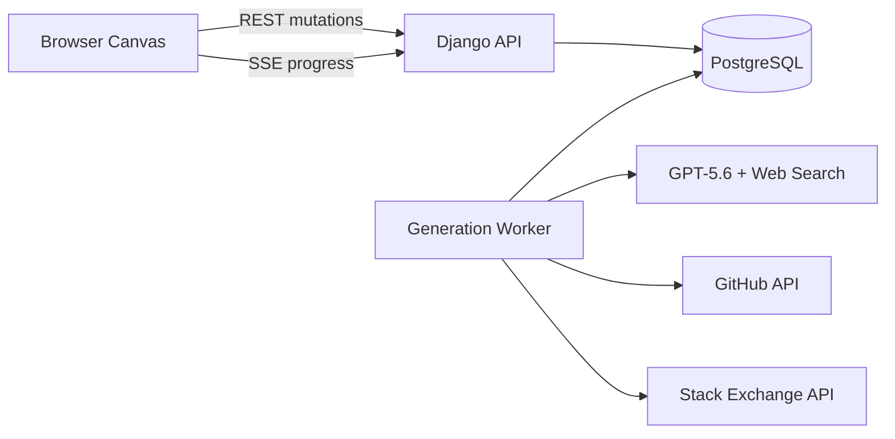
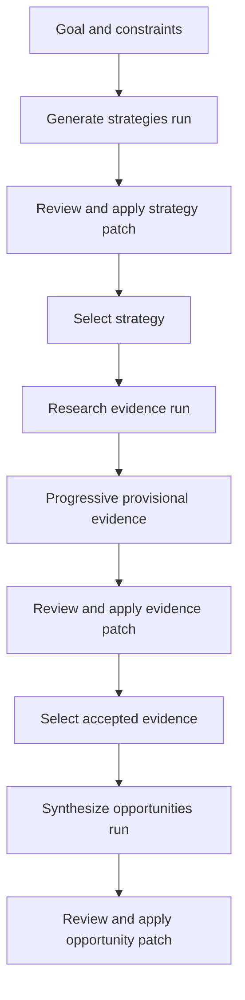

# Evidence-Native Opportunity Canvas
## Product and System Design Document

**Status:** Architecture frozen; implementation-ready draft  
**Document type:** Product and technical design  
**Target:** OpenAI Build Week hackathon MVP  
**Primary track:** Work & Productivity  
**Primary user:** Technical founder or product builder  
**Last updated:** July 14, 2026
**Author:** Daniel Pittaluga

---

## 1. Executive Summary

Evidence-Native Opportunity Canvas is a graph-native ideation system that helps technical founders turn vague goals, constraints, and public market signals into credible software business opportunities.

The system does not ask the model to invent startup ideas from a blank prompt. Instead, it:

1. Generates high-leverage opportunity strategies.
2. Researches observable market evidence.
3. Converts sources into structured claims.
4. Synthesizes specific opportunity candidates.
5. Critiques those candidates for novelty, feasibility, evidence strength, and builder fit.
6. Produces a graph patch that the user can inspect and apply.

The product is intentionally designed as a graph rather than a chat interface. Users can select multiple nodes, generate descendants, trace provenance, reject evidence, branch ideas under different constraints, and regenerate only affected downstream nodes.

The hackathon architecture favors application-layer correctness over infrastructure breadth:

- Django backend
- PostgreSQL for graph state, durable jobs, events, and patches
- PostgreSQL `SKIP LOCKED` queue
- Separate worker process
- Server-Sent Events for progress
- Optimistic entity versioning
- Short database transactions
- Fenced worker leases
- GPT-5.6 with web search and structured outputs
- Ports-and-adapters execution profiles for live, hybrid-demo, and replay modes
- Cascade invalidation instead of automatic descendant regeneration
- Resumable stage checkpoints keyed by semantic input and provider identity
- Bounded worker lifetimes and graceful process recycling
- No Redis, Celery, Neo4j, or WebSockets in the MVP

---

## 2. Product Thesis

### 2.1 Core problem

Most AI brainstorming tools produce plausible prose but weak decisions. They lack:

- Evidence
- Provenance
- Contradicting signals
- Builder-specific constraints
- Explicit opportunity mechanisms
- Regeneration semantics
- A durable model of how ideas evolved

The result is often an attractive but unsupported concept.

### 2.2 Product proposition

> Turn observable market signals into specific, testable software opportunities.

The system should answer:

> Where is there already strong evidence that a product should exist, and what product could this particular builder realistically create?

### 2.3 Core differentiation

The product is not a mind map with an AI button. Its differentiated layer is:

- Typed graph objects
- Opportunity-strategy templates
- Evidence extraction and classification
- Multi-node transformations
- Provenance-aware generation
- Contradiction handling
- Builder-fit constraints
- Branching and partial regeneration
- Structured graph patches rather than prose replacement

---

## 3. Goals and Non-Goals

### 3.1 MVP goals

The MVP must allow a user to:

1. Create a canvas.
2. Add a goal and builder constraints.
3. Generate at least three distinct opportunity strategies.
4. Select one strategy and research evidence.
5. Inspect source-backed evidence claims.
6. Select evidence and generate opportunity candidates.
7. Inspect assumptions, contradictions, risks, and validation experiments.
8. Accept or reject generated graph patches.
9. Change or remove a premise and regenerate only dependent descendants.
10. Save and reload the canvas.
11. Complete the canonical workflow without private setup.

### 3.2 Non-goals

The MVP will not include:

- Real-time multi-user collaboration
- Mobile-first canvas editing
- Arbitrary ontology design
- Full market sizing
- Financial forecasting
- Autonomous research lasting several minutes
- Dozens of data connectors
- Team permissions
- Neo4j or another graph database
- Redis or Celery
- WebSocket-based collaboration
- Comprehensive venture diligence
- Production-grade billing
- Long-term semantic memory across all canvases

---

## 4. Target User and Terminal Outcome

### 4.1 Target user

A technical founder or product builder who:

- Can build software
- Has limited capital
- Needs a credible opportunity rather than generic inspiration
- Wants to reason through evidence and constraints
- Is willing to validate before committing to implementation

### 4.2 Terminal artifact

A completed opportunity node must contain:

- Buyer
- Problem
- Existing spend or workaround
- Product mechanism
- Business model
- Why now
- Supporting evidence
- Contradicting evidence
- Critical assumptions
- Main risks
- Validation experiment
- Builder-fit rationale

The canvas is a means to produce this artifact, not an end in itself.

---

## 5. Canonical User Journey

### 5.1 Input

The user enters:

> Find a recurring-revenue software opportunity for a solo Python developer.

Constraint nodes:

- Skills: Python, Django, backend systems
- Team size: one
- Capital: low
- Time to MVP: eight weeks
- Preferred model: B2B subscription
- Operational tolerance: low
- Sales preference: self-service

### 5.2 Strategy generation

The system creates:

- Repackage validated demand
- Productize recurring service work
- Commercialize an open-source workflow

### 5.3 Evidence research

The user selects `Productize recurring service work` and clicks **Find evidence**.

The system researches:

- Public service pricing
- Repeated manual workflow descriptions
- Job postings
- Technical discussions
- Existing workaround tools
- Customer complaints

Validated extraction batches appear progressively as provisional source and claim nodes. When research completes, the user reviews and applies the evidence patch, rejects any unsuitable evidence, and selects the accepted evidence nodes to use for synthesis.

### 5.4 Opportunity synthesis

The user starts a separate synthesis run from the selected accepted evidence.

The system generates:

> Automated security questionnaire workspace for small SaaS vendors.

The opportunity is supported by:

- Evidence that companies pay consultants for questionnaire completion
- Repeated complaints about manual document reuse
- Publicly observable recurrence of vendor-security reviews
- Existing but overbuilt enterprise solutions

### 5.5 Critique

The system adds:

- Risk: Enterprise incumbents may move downmarket
- Contradiction: Some customers may prefer services over software
- Assumption: Small SaaS vendors complete enough questionnaires to justify subscription pricing
- Validation: Interview ten SaaS security leads and request three paid design-partner commitments

---

## 6. Opportunity Strategy Ontology

The model should not invent strategy mechanisms from scratch on every run. The system starts with curated strategy templates and allows GPT-5.6 to adapt or combine them.

### 6.1 Initial strategies

1. Repackage validated demand
2. Productize recurring service work
3. Replace a critical spreadsheet
4. Unbundle a valuable feature
5. Rebundle a fragmented workflow
6. Commercialize an open-source project
7. Move an enterprise capability downmarket
8. Automate mandatory work
9. Prevent an expensive failure
10. Remove a scarce-expert bottleneck
11. Exploit a disliked pricing model
12. Build infrastructure around a growing ecosystem
13. Convert operational data into decisions
14. Turn a marketplace participant workflow into SaaS

### 6.2 Strategy schema

```json
{
  "id": "productize_recurring_service",
  "title": "Productize recurring service work",
  "description": "Convert a repeated, expensive service workflow into software.",
  "required_signals": [
    "customers already pay for the outcome",
    "the workflow repeats",
    "inputs and outputs are partially structured"
  ],
  "failure_conditions": [
    "most work requires bespoke expert judgment",
    "delivery depends primarily on local physical labor"
  ],
  "default_research_queries": [
    "service pricing",
    "manual workflow",
    "consulting package",
    "spreadsheet template",
    "job description"
  ]
}
```

---

## 7. Quality Contract

“Brilliant” must be operationalized rather than left to model taste.

### 7.1 Required dimensions

| Dimension | Definition |
|---|---|
| Economic leverage | Converts existing revenue, labor, obligation, data, distribution, or infrastructure into a product opportunity |
| Evidence strength | Supported by independent observations |
| Novelty | Uses a meaningful transformation, not only “X with AI” |
| Specificity | Identifies buyer, problem, mechanism, and business model |
| Builder fit | Matches the user’s skills, capital, timeline, and operating preferences |
| Technical feasibility | Can plausibly be built and operated |
| Distribution clarity | Provides a credible path to reach buyers |
| Defensibility | Explains why the opportunity is not immediately erased |
| Testability | Includes a cheap falsifiable validation experiment |
| Honesty | Separates observation, derivation, and inference |

### 7.2 Separate dimensions, not one score

Do not collapse all quality dimensions into a single synthetic score.

Display separately:

- Evidence strength
- Novelty
- Builder fit
- Technical feasibility
- Distribution clarity
- Operational burden

This avoids false precision and lets users choose their preferred risk profile.

### 7.3 Support threshold

An opportunity may be labeled `supported` only when it includes:

- One spending, revenue, or labor-cost signal
- Two independent demand or pain signals
- One identifiable buyer
- One plausible distribution channel
- One material contradiction or risk
- One validation experiment

Otherwise it is labeled `speculative`.

---

## 8. Evidence Model

### 8.1 Source versus claim

A source and a claim are separate entities.

One source can support multiple claims. One claim can be supported by multiple sources.

```text
Source: Pricing page
  ├── supports → Minimum plan is $299/month
  └── supports → Pricing is per seat

Source: User discussion
  └── supports → Small teams perceive pricing as expensive
```

### 8.2 Evidence classifications

- `observed`: directly present in a source
- `derived`: calculated from source data
- `inferred`: model interpretation
- `contradicting`: evidence against the opportunity

### 8.2.1 Evidence rejection semantics

Evidence rejection is an authoritative user action, not a visual-only preference.

When a source or claim is rejected:

- The node remains in the graph operation history for auditability.
- Its semantic metadata records `review_status: rejected` and the rejecting operation.
- It is excluded from future context packing, support-threshold calculations, synthesis, and critique.
- Accepted descendants that depended on it are marked stale through the normal transitive invalidation rules.
- Rejecting a source rejects claims supported only by that source; claims with other accepted independent sources remain eligible but lose the rejected source from their support calculation.

Whether rejected evidence remains visible as a muted node is a presentation decision and does not change these semantics.

### 8.3 Source hierarchy

1. Official pricing, filings, documentation
2. Structured public APIs
3. Reputable reporting and case studies
4. Marketplace listings
5. Technical discussions and forums
6. Anonymous individual comments

### 8.4 MVP evidence sources

Required:

- OpenAI hosted web search
- GitHub public API
- Stack Exchange API
- User-supplied URLs or text

Optional stretch sources:

- Hacker News search
- SEC filings

Avoid in MVP:

- Reddit API
- LinkedIn
- G2 scraping
- Capterra scraping
- Crunchbase
- Unofficial Google Trends clients
- Product Hunt OAuth
- Arbitrary headless-browser crawling

### 8.5 Claim schema

```json
{
  "id": "claim_123",
  "claim": "Small teams find the product operationally complex.",
  "classification": "observed",
  "evidence_type": "customer_pain",
  "topic_keys": ["vendor_security_review"],
  "mechanism_tags": ["automate_mandatory_work"],
  "independence_key": "publisher:example.com",
  "strength": "medium",
  "limitations": [
    "Single discussion thread",
    "Segment may not be representative"
  ],
  "source_ids": ["source_1", "source_9"]
}
```

Extraction emits sorted, deduplicated `topic_keys` and `mechanism_tags` as normalized lowercase slugs. `mechanism_tags` use the versioned opportunity-strategy vocabulary where applicable. `independence_key` identifies the canonical publisher or originating dataset so syndicated or mirrored observations do not count as independent support.

### 8.6 Source schema

```json
{
  "id": "source_1",
  "kind": "web",
  "url": "https://example.com/pricing",
  "title": "Example pricing",
  "retrieved_at": "2026-07-13T20:15:00Z",
  "content_hash": "sha256:...",
  "metadata": {
    "domain": "example.com",
    "authoritative": true
  }
}
```

---

## 9. Graph Domain Model

### 9.1 Node kinds

The MVP supports:

- `goal`
- `constraint`
- `strategy`
- `source`
- `claim`
- `opportunity`
- `assumption`
- `risk`
- `validation_experiment`
- `generation_placeholder`

### 9.2 Edge kinds

- `supports`
- `contradicts`
- `derived_from`
- `constrained_by`
- `evolves_into`
- `requires_validation`
- `extracted_from`

### 9.2.1 Dependency direction and invalidation

Dependency traversal uses semantic direction, which is not always the stored edge direction:

| Edge kind | Stored source → target meaning | Invalidation direction |
|---|---|---|
| `supports` | Evidence supports a claim or opportunity | source → target |
| `contradicts` | Evidence contradicts a claim or opportunity | source → target |
| `derived_from` | Upstream premise evolves into a derived node | source → target |
| `evolves_into` | Earlier node evolves into a later node | source → target |
| `requires_validation` | Premise requires a validation experiment | source → target |
| `constrained_by` | Candidate is constrained by a constraint node | target → source |
| `extracted_from` | Claim is extracted from a source node | target → source |

Editing, deleting, rejecting, or disconnecting an upstream node or dependency edge marks every reachable dependent node stale in this direction. Edge deletion uses the persisted pre-delete relationship; an edge kind or endpoint change evaluates both its pre-mutation and post-mutation dependency relationships. Traversal is breadth-first with a visited set, so converging paths and accidental cycles terminate deterministically. The changed origin is never marked stale by a cycle back-edge. Provenance/context traversal uses the inverse relation when walking from a selected node to its semantic ancestors.

### 9.3 Node structure

```json
{
  "id": "node_123",
  "canvas_id": "canvas_1",
  "kind": "opportunity",
  "title": "Managed Django Fleet",
  "body": "A fixed-price operations platform...",
  "metadata": {
    "buyer": "Web development agencies",
    "business_model": "Per-application subscription",
    "status": "supported"
  },
  "position": {
    "x": 812,
    "y": 405
  },
  "version": 3,
  "position_version": 7,
  "context_token_count": 147
}
```

`version` is the semantic version used by generation requests and graph-patch preconditions. `position_version` protects layout-only updates. `MOVE_NODE` requires `expected_position_version`, increments only `position_version`, and still appends a graph operation and increments the canvas revision. Semantic mutations require `expected_version`, increment `version`, and invalidate the cached semantic token representation. Layout changes therefore do not invalidate generation context or conflict with semantic patch updates.

### 9.4 Graph-native requirements

The graph must support behavior that a chat transcript cannot provide:

- Multi-node synthesis
- Provenance tracing
- Branch comparison
- Dependency-aware invalidation and explicit regeneration
- Evidence rejection
- Assumption replacement
- Descendant invalidation
- Partial patch acceptance

---

## 10. High-Level Architecture



### 10.1 Runtime components

- Web application process
- Generation worker process
- PostgreSQL

No additional infrastructure is required for the MVP.

---

## 11. Frontend-Backend State Contract

### 11.1 Current-state model plus operation log

The system is not fully event-sourced.

It uses:

1. Relational current-state tables
2. Append-only graph operations
3. Generated patches requiring explicit user acceptance

### 11.2 API mutation model

The frontend sends localized operations, not complete graph snapshots.

Examples:

- `ADD_NODE`
- `UPDATE_NODE`
- `DELETE_NODE`
- `ADD_EDGE`
- `UPDATE_EDGE`
- `DELETE_EDGE`
- `PATCH_NODE_METADATA`
- `MOVE_NODE`

Every direct mutation includes a client-generated `operation_key`. Semantic node operations carry `expected_version`; `MOVE_NODE` carries `expected_position_version`; edge updates/deletes carry the edge `expected_version`. The server stores a request fingerprint with the operation key so network retries are idempotent without accepting conflicting reuse.

### 11.3 Graph patch principle

The AI never writes directly to the authoritative graph.

It produces a candidate `GraphPatch`.

```json
{
  "base_canvas_revision": 47,
  "operations": [
    {
      "op": "ADD_NODE",
      "client_generated_id": "candidate_1",
      "node": {
        "kind": "opportunity",
        "title": "Managed Django Fleet"
      }
    },
    {
      "op": "ADD_EDGE",
      "source": "node_14",
      "target": "candidate_1",
      "kind": "derived_from"
    }
  ]
}
```

Every `client_generated_id` must be unique within the patch. An operation may reference an existing entity UUID or a prior client-generated ID. Patch validation builds an operation dependency graph, rejects missing or forward-incompatible references, and requires a selected partial-acceptance subset to include every prerequisite operation.

While holding the patch lock during apply, the server allocates UUIDs for accepted client-generated IDs and persists the resulting `client_id_map` in the same transaction as graph writes. Later operations resolve through that map, and the apply response returns it. Idempotent retries return the persisted map rather than allocating new identities.

---

## 12. Persistence Model

### 12.1 Canvas

```sql
CREATE TABLE canvas (
    id uuid PRIMARY KEY,
    title text NOT NULL,
    revision bigint NOT NULL DEFAULT 0,
    created_at timestamptz NOT NULL,
    updated_at timestamptz NOT NULL
);
```

### 12.2 Node

```sql
CREATE TABLE node (
    id uuid PRIMARY KEY,
    canvas_id uuid NOT NULL REFERENCES canvas(id),
    kind text NOT NULL,
    title text NOT NULL,
    body text,
    metadata jsonb NOT NULL DEFAULT '{}',
    position jsonb NOT NULL DEFAULT '{}',
    version bigint NOT NULL DEFAULT 1,
    position_version bigint NOT NULL DEFAULT 1,
    context_token_count integer,
    context_representation_version integer NOT NULL DEFAULT 1,
    context_content_hash text,
    created_at timestamptz NOT NULL,
    updated_at timestamptz NOT NULL
);
```

### 12.3 Edge

```sql
CREATE TABLE edge (
    id uuid PRIMARY KEY,
    canvas_id uuid NOT NULL REFERENCES canvas(id),
    source_node_id uuid NOT NULL REFERENCES node(id),
    target_node_id uuid NOT NULL REFERENCES node(id),
    kind text NOT NULL,
    metadata jsonb NOT NULL DEFAULT '{}',
    version bigint NOT NULL DEFAULT 1,
    created_at timestamptz NOT NULL,
    updated_at timestamptz NOT NULL
);
```

### 12.4 Graph operation

```sql
CREATE TABLE graph_operation (
    id bigint GENERATED ALWAYS AS IDENTITY PRIMARY KEY,
    canvas_id uuid NOT NULL REFERENCES canvas(id),
    actor_type text NOT NULL,
    actor_id text,
    operation_key text NOT NULL,
    request_fingerprint text NOT NULL,
    operation_type text NOT NULL,
    payload jsonb NOT NULL,
    result_payload jsonb NOT NULL,
    canvas_revision bigint NOT NULL,
    created_at timestamptz NOT NULL,
    UNIQUE (canvas_id, actor_type, operation_key)
);
```

For direct API mutations, `operation_key` is a client-generated UUID. `payload` stores the canonical request and `result_payload` stores created entity IDs and resulting versions needed to reproduce the response. Replaying the same key with the same fingerprint returns that original result; reusing it with different content returns `409 Conflict`. Patch application derives a deterministic key from patch ID and operation index.

### 12.5 Generation run

```sql
CREATE TABLE generation_run (
    id uuid PRIMARY KEY,
    canvas_id uuid NOT NULL REFERENCES canvas(id),
    operation text NOT NULL,
    idempotency_key text NOT NULL,
    request_fingerprint text NOT NULL,
    status text NOT NULL,
    current_stage text,
    base_canvas_revision bigint NOT NULL,
    context_snapshot jsonb NOT NULL,
    context_manifest jsonb NOT NULL,
    context_hash text NOT NULL,
    selected_node_ids jsonb NOT NULL,
    expected_node_versions jsonb NOT NULL,
    execution_configuration jsonb NOT NULL,
    worker_id text,
    lease_token uuid,
    lease_epoch bigint NOT NULL DEFAULT 0,
    attempt integer NOT NULL DEFAULT 0,
    max_attempts integer NOT NULL DEFAULT 3,
    heartbeat_at timestamptz,
    lease_expires_at timestamptz,
    cancel_requested_at timestamptz,
    error jsonb,
    created_at timestamptz NOT NULL,
    started_at timestamptz,
    completed_at timestamptz,
    UNIQUE (canvas_id, idempotency_key)
);
```

### 12.6 Generation stage

```sql
CREATE TABLE generation_stage (
    id uuid PRIMARY KEY,
    run_id uuid NOT NULL REFERENCES generation_run(id),
    name text NOT NULL,
    input_hash text NOT NULL,
    status text NOT NULL,
    attempt integer NOT NULL DEFAULT 0,
    openai_response_id text,
    output jsonb,
    error jsonb,
    started_at timestamptz,
    completed_at timestamptz,
    UNIQUE (run_id, name, input_hash)
);
```

### 12.7 Canvas event cursor

Canvas-scoped SSE replay requires one monotonic cursor shared by every run on the canvas.

```sql
CREATE TABLE canvas_event_cursor (
    canvas_id uuid PRIMARY KEY REFERENCES canvas(id),
    last_sequence bigint NOT NULL DEFAULT 0
);
```

The cursor row is created atomically with every new canvas. The migration that introduces this table backfills exactly one row for every existing canvas. Event append increments `last_sequence` and inserts the event in the same short transaction. This serializes event numbering per canvas without locking the canvas graph-state row.

### 12.8 Generation event

```sql
CREATE TABLE generation_event (
    id bigint GENERATED ALWAYS AS IDENTITY PRIMARY KEY,
    canvas_id uuid NOT NULL REFERENCES canvas(id),
    run_id uuid NOT NULL REFERENCES generation_run(id),
    canvas_sequence bigint NOT NULL,
    run_sequence bigint NOT NULL,
    event_type text NOT NULL,
    payload jsonb NOT NULL,
    created_at timestamptz NOT NULL,
    UNIQUE (canvas_id, canvas_sequence),
    UNIQUE (run_id, run_sequence)
);
```

`canvas_sequence` is the SSE replay cursor. `run_sequence` preserves ordering within one run for diagnostics and validation.

### 12.9 Graph patch

```sql
CREATE TABLE graph_patch (
    id uuid PRIMARY KEY,
    run_id uuid NOT NULL REFERENCES generation_run(id),
    canvas_id uuid NOT NULL REFERENCES canvas(id),
    base_canvas_revision bigint NOT NULL,
    operations jsonb NOT NULL,
    client_id_map jsonb NOT NULL DEFAULT '{}',
    status text NOT NULL,
    created_at timestamptz NOT NULL,
    decided_at timestamptz,
    applied_at timestamptz
);
```

Allowed patch statuses are `pending`, `applied`, `partially_applied`, and `rejected`.

### 12.10 Graph patch operation decision

Partial acceptance and auditability require an explicit decision for every reviewed candidate operation.

```sql
CREATE TABLE graph_patch_operation_decision (
    id uuid PRIMARY KEY,
    patch_id uuid NOT NULL REFERENCES graph_patch(id),
    operation_index integer NOT NULL,
    decision text NOT NULL,
    reason text,
    actor_type text NOT NULL,
    actor_id text,
    graph_operation_id bigint REFERENCES graph_operation(id),
    decided_at timestamptz NOT NULL,
    UNIQUE (patch_id, operation_index)
);
```

Allowed operation decisions are `accepted`, `rejected`, and `skipped_conflict`. `graph_operation_id` is populated only when the candidate operation is applied. A full rejection records `rejected` for every candidate operation; a nonconflicting apply records `skipped_conflict` for operations that fail preconditions.

---

## 13. Context Neighborhood Protocol

### 13.1 Problem

Sending the complete canvas to GPT-5.6 causes:

- Token waste
- Higher latency
- Prompt dilution
- Reduced relevance
- Increased cost
- More accidental duplication

### 13.2 Operation-specific context

Context selection is operation-specific and token-budgeted.

#### Mandatory

- Selected nodes
- Global pinned constraints
- Current operation
- User instruction
- Node IDs, semantic versions, and position versions where spatial state is relevant

#### High priority

- Provenance ancestors
- Supporting evidence
- Contradicting evidence
- Direct descendants
- Existing opportunities from the same inputs

#### Optional

- Sibling nodes
- Cluster summaries
- Semantically related nodes
- Nearby risks and assumptions

#### Excluded

- Canvas coordinates
- Styling
- Selection state
- UI expansion state
- Full source pages when claims exist
- Unrelated branches

### 13.3 Default budget

```python
CONTEXT_BUDGET = {
    "selected_nodes": 0.30,
    "global_constraints": 0.15,
    "provenance": 0.20,
    "evidence": 0.20,
    "descendants": 0.10,
    "related_summary": 0.05,
}
```

### 13.4 Deterministic intra-tier truncation

When a tier exceeds its token allocation, candidates are ranked deterministically before packing.

#### Provenance and ancestors

1. Shortest graph distance from the selected node
2. Direct parent before grandparent
3. Edge relevance to the current operation
4. Most recently updated
5. Stable node ID as final tie-breaker

Traversal uses breadth-first search upward. Direct parents are retained first, then grandparents and older roots until the tier budget is exhausted.

#### Evidence

A bounded contradiction reserve is allocated before supporting evidence is packed.

Ranking order:

1. Contradicting evidence reserve
2. Strength metadata
3. Source authority
4. Number of independent supporting sources
5. Retrieval recency
6. Stable claim ID as final tie-breaker

#### Descendants

1. Direct children
2. Semantic relevance to the requested operation
3. Most recently updated
4. Stable node ID as final tie-breaker

Packing must be deterministic for an identical context snapshot, pipeline version, and token budget.

### 13.5 Context manifest

Every run persists the included and excluded entities.

```json
{
  "selected": ["node_14", "node_15"],
  "constraints": ["node_2", "node_5"],
  "ancestors": ["node_8"],
  "descendants": ["node_18"],
  "evidence": ["claim_31", "source_9"],
  "excluded_due_to_budget": ["node_44"]
}
```

### 13.6 Precomputed token counts

`context_token_count` is computed from the canonical semantic representation of a node, not from UI metadata.

```python
def node_context_representation(node):
    return {
        "id": str(node.id),
        "kind": node.kind,
        "title": node.title,
        "body": node.body,
        "semantic_metadata": filter_semantic_metadata(node.metadata),
    }
```

A fixed reserve must account for:

- System instructions
- JSON wrappers
- Edge serialization
- Response budget
- Evidence excerpts

---

## 14. Generation Pipeline

The canonical journey uses multiple operation-specific generation runs. Research evidence must be reviewed and applied before it can be selected for opportunity synthesis.



### 14.1 Operation stage plans

| Operation | Required stages |
|---|---|
| `generate_strategies` | Plan → Patch construction |
| `research_evidence` | Plan → Research → Extract → Cluster → Patch construction |
| `synthesize_opportunities` | Synthesize → Critique → Patch construction |
| `regenerate_stale` | Resolve the affected operation plan from the stale node kind, then execute only that plan |

Only stages in the selected operation plan execute. Every executed stage is checkpointed independently.

Evidence emitted during research progress is provisional. It may be inspected as soon as a normalized extraction batch passes schema validation, but it does not become authoritative graph state until the user accepts the final evidence patch. Opportunity synthesis accepts only applied, non-rejected evidence nodes selected by the user; it never consumes provisional evidence.

### 14.2 Stage definitions

#### Plan

For `generate_strategies`, produces at least three materially different strategies adapted from the curated ontology.

For `research_evidence`, produces:

- Selected opportunity strategy
- Research questions
- Query plan
- Required evidence types

#### Research

Uses:

- OpenAI web search
- GitHub API
- Stack Exchange API
- User-supplied URLs or text

#### Extract

Produces normalized:

- Sources
- Claims
- Strength
- Classification
- Limitations

#### Cluster

Deterministically groups normalized claims by the exact tuple of evidence type, sorted `topic_keys`, sorted `mechanism_tags`, and contradiction target while preserving source IDs and `independence_key` boundaries.

Clustering is an application-layer stage shared by every execution profile, not a model-provider call. It is checkpointed as `clustering`, carries a versioned identity such as `deterministic_clusterer_v1`, and participates in stage input hashing.

#### Synthesize

Produces three structured opportunities.

#### Critique

Checks:

- Is this only a feature?
- Is the buyer identifiable?
- Is there budget?
- Is the pain repeated?
- Is the evidence relevant?
- Is the idea materially differentiated?
- Is the operating burden acceptable?
- What evidence would disprove it?

#### Patch construction

Produces typed graph operations only.

---

## 15. Long-Running Job Architecture

### 15.0 Durable-layer ports and phase boundary

The durable-job layer depends on three interfaces rather than Phase 3 implementations:

- `RunContextFactory`
- `ExecutionProfileResolver`
- `StageOutputValidator`

Phase 2 defines their stable envelopes and test-only deterministic adapters. The test profile is never selectable by a product request. Phase 3 supplies the production semantic context factory, approved execution-profile resolver, and stage-specific structured-output validators. The composition root rejects an unavailable profile; it never falls back to a test adapter or another live profile.

This lets queue, lease, checkpoint, retry, and SSE behavior be completed with deterministic test jobs without duplicating or prematurely implementing the intelligence pipeline. The approved `live_v1`, `demo_hybrid_v1`, and `replay_v1` profiles are enabled for product requests only when PG-020 integrates the Phase 3 implementations.

### 15.1 Trigger

```http
POST /api/canvases/{canvas_id}/generation-runs
```

```json
{
  "selected_node_ids": ["node_14", "node_15"],
  "operation": "research_evidence",
  "instruction": "Find current evidence for this strategy.",
  "execution_profile_id": "live_v1",
  "idempotency_key": "71a43...",
  "expected_node_versions": {
    "node_14": 3,
    "node_15": 6
  }
}
```

Response:

```http
HTTP/1.1 202 Accepted
```

```json
{
  "run_id": "run_123",
  "status": "queued",
  "events_url": "/api/canvases/canvas_1/events?after=918"
}
```

Run creation occurs in one short transaction:

1. Validate the requested operation and selected-node kinds.
2. Lock and verify every `expected_node_versions` entry.
3. Capture the canvas revision, semantic context snapshot, context manifest, context hash, and immutable execution configuration.
4. Create the queued run and commit.

`idempotency_key` is unique per canvas. Repeating the same key with the same semantic request returns the existing run; reusing it with a different operation, selected nodes, versions, or instruction returns `409 Conflict`. The endpoint returns `202 Accepted` immediately and never executes provider work inline.

```http
GET /api/generation-runs/{run_id}
```

The status endpoint returns the run state, current stage, attempts, terminal error when present, and ready patch ID when available.

### 15.2 Job state machine

```text
queued
  → running
      → one or more configured stages:
          planning
          researching
          extracting
          clustering
          synthesizing
          critiquing
          constructing_patch
      → patch_ready
  → completed

Terminal alternatives:
  failed
      → queued when an explicit safe retry is accepted
  cancelled
```

Only stages in the operation plan from section 14.1 are visited. `patch_ready` means the candidate patch has been persisted; the run then becomes `completed` without waiting for user review. Patch review has its own lifecycle.

### 15.3 Worker claiming

The worker claims one eligible job with:

```sql
SELECT id
FROM generation_run
WHERE
    status = 'queued'
    OR (
        status = 'running'
        AND lease_expires_at < now()
    )
ORDER BY created_at
FOR UPDATE SKIP LOCKED
LIMIT 1;
```

### 15.4 Fenced lease

Every lease receives:

- `worker_id`
- `lease_token`
- Incremented `lease_epoch`

Every worker write must match:

- Run ID
- Lease token
- Lease epoch
- Running status

A stale worker must be unable to checkpoint or finalize after reassignment.

### 15.5 Heartbeat

A dedicated lease-keeper thread uses its own database connection and performs a conditional update every 10–15 seconds.

```python
LEASE_DURATION_SECONDS = 60
HEARTBEAT_INTERVAL_SECONDS = 12
```

Lease timestamps use PostgreSQL `now()`, never application-host clocks. A renewal extends expiry to database time plus the full lease duration and succeeds only for the current token and epoch. Reclaim is permitted only after database time passes `lease_expires_at`. Tests must cover a delayed heartbeat that remains within the lease, expiry and reclaim, and a late renewal from the fenced worker.

The main orchestration thread can block on OpenAI without holding a database transaction.

### 15.6 Worker lifecycle and recycling

Long-running Django worker processes must have bounded lifetimes.

Default limits:

```python
MAX_JOBS_PER_WORKER = 50
MAX_WORKER_LIFETIME_SECONDS = 14_400
```

The worker exits gracefully after either threshold is reached. The process supervisor restarts it.

At the end of every job-loop iteration, the worker must:

```python
from django.db import close_old_connections, reset_queries

reset_queries()
close_old_connections()
```

It must also release stage-local caches, dereference large response payloads, and stop the lease-keeper thread before claiming another job.

---

## 16. Transaction Boundaries

### 16.1 Governing invariant

> No database transaction may contain an HTTP request, model stream iteration, search call, retry sleep, or user-visible streaming loop.

### 16.2 Transaction matrix

| Operation | Transaction | External work allowed |
|---|---:|---:|
| Claim run | Short atomic | No |
| Renew heartbeat | Single autocommit update | No |
| Mark stage started | Short atomic | No |
| OpenAI or search call | None | Yes |
| Persist stage result | Short atomic | No |
| Append progress event | Short atomic or autocommit | No |
| Create final patch | Short atomic | No |
| Mark failed or cancelled | Short atomic | No |
| Requeue an explicitly retried run | Short atomic with row lock | No |
| Apply patch | Short atomic with row locks | No |

### 16.3 Stage protocol

```text
Transaction A:
    Verify lease
    Mark stage started
    Persist input hash
    Append event
Commit

External operation:
    OpenAI/search/API call

Transaction B:
    Verify lease
    Persist normalized result
    Mark stage completed
    Append event
Commit
```

### 16.4 Execution guarantee

The pipeline provides at-least-once execution, not exactly-once execution.

Mitigations:

- Immutable stage input hashes
- Unique stage keys
- Persisted OpenAI response IDs
- Stage result reuse
- GraphPatch isolation
- Idempotency keys
- No direct AI writes to graph state

### 16.5 Stage re-entry and resume semantics

A failed run may transition back to `queued`, but completed stage checkpoints remain immutable and reusable.

Before executing a stage, the worker must:

1. Resolve the concrete provider for the run execution profile.
2. Calculate the stage input hash from semantic input, stage version, provider identity, profile, and fixture version.
3. Look for a successfully completed `generation_stage` with the same key.
4. Reuse its validated output when present.
5. Execute only the first incomplete or invalidated stage.

Example retry behavior:

```text
Planning completed
Research completed
Extraction completed
Clustering failed
        ↓ retry
Planning reused
Research reused
Extraction reused
Clustering resumes
```

This avoids duplicate research, model calls, and billing after transient failures.

---

## 17. SSE Progress Transport

### 17.1 One stream per canvas

```http
GET /api/canvases/{canvas_id}/events?after={canvas_sequence}
```

Do not open one connection per generation run.

### 17.2 Event types

- `run.started`
- `run.resumed`
- `run.retry_requested`
- `stage.started`
- `stage.progress`
- `research.query_created`
- `research.source_found`
- `evidence.extracted`
- `candidate.generated`
- `candidate.critiqued`
- `patch.ready`
- `run.completed`
- `run.failed`
- `run.cancelled`

`research.source_found` and `evidence.extracted` payloads include `provisional: true` until the evidence patch is accepted. `patch.ready` includes the candidate patch ID. Progress events never imply that graph state was mutated.

### 17.3 Persistence and replay

Events are persisted in PostgreSQL.

The SSE endpoint:

1. Replays committed events with `canvas_sequence` greater than the supplied cursor, in ascending order.
2. Waits for new events.
3. Reconnects safely after disconnects.

Every emitted event includes both `canvas_sequence` and `run_sequence`. Concurrent runs on the same canvas share the canvas cursor and cannot produce duplicate replay positions. Integration tests must interleave events from at least two runs and prove that reconnect neither skips nor duplicates committed events.

`LISTEN/NOTIFY` may be used as a wake-up mechanism, but the event table remains authoritative.

### 17.4 HTTP/2

Production should support HTTP/2 to avoid HTTP/1.1 connection-limit issues and improve multiplexing.

Correctness must not depend on HTTP/2 because the application uses only one canvas-scoped stream.

### 17.5 Local development streaming requirements

Local development must verify that SSE events are delivered incrementally rather than buffered until completion.

Requirements:

- Use an ASGI server for realistic streaming behavior.
- Do not apply response-compression middleware to `text/event-stream`.
- Do not use middleware that consumes or materializes the streaming iterator.
- Disable proxy buffering when developing behind a local reverse proxy.
- Emit periodic SSE heartbeat comments such as `: keepalive\n\n`.
- Do not attempt to calculate `Content-Length` for SSE responses.

Verification command:

```bash
curl -N \
  -H "Accept: text/event-stream" \
  http://localhost:8000/api/canvases/<id>/events
```

The setup guide must include the exact development-server and proxy configuration used by the project.

---

## 18. Patch Application and Concurrency

### 18.1 Entity-level versions

Each edge has an incrementing semantic `version`. Each node has an incrementing semantic `version` plus an independent `position_version` for spatial changes.

Generated semantic update or delete operations include `expected_version`. `MOVE_NODE` includes `expected_position_version`. Moving a node must not increment its semantic version or invalidate semantic context caches; semantic edits must not create false position conflicts.

### 18.2 Conflict handling

- `ADD_NODE`: requires a unique patch-local identity
- `ADD_EDGE`: requires endpoints to exist or resolve through accepted prerequisite operations
- `UPDATE_NODE` and `PATCH_NODE_METADATA`: require `expected_version`
- `MOVE_NODE`: requires `expected_position_version`
- `DELETE_NODE`: requires `expected_version` and explicit handling of incident edges
- `UPDATE_EDGE` and `DELETE_EDGE`: require the edge `expected_version`

`base_canvas_revision` is an audit and context marker, not a global optimistic-lock precondition. Apply conflicts are decided by the touched entity versions and dependency validation, so an unrelated edit or position-only canvas revision change cannot reject an otherwise valid semantic patch.

### 18.3 Atomic application

Patch application occurs in one transaction.

The endpoint:

1. Locks the patch.
2. Locks the canvas.
3. Locks touched nodes and edges in deterministic ID order.
4. Validates expected versions.
5. Validates the accepted operation dependency graph and prerequisite closure.
6. Allocates and persists the accepted `client_generated_id` to UUID map.
7. Resolves references and applies accepted operations in dependency order.
8. Writes idempotent graph-operation records and links them to `accepted` patch-operation decisions.
9. Records `rejected` and `skipped_conflict` decisions for every reviewed operation not applied.
10. Increments canvas revision when at least one graph operation was applied.
11. Sets the patch to `applied`, `partially_applied`, or `rejected` and records decision timestamps.
12. Commits and returns the persisted client ID map.

### 18.4 Isolation level

Use PostgreSQL `READ COMMITTED` plus explicit `SELECT FOR UPDATE` row locks.

Do not default to `REPEATABLE READ`. The entities are known by primary key, and row locks provide the necessary serialization without introducing avoidable serialization failures.

### 18.5 Partial acceptance

The user may:

- Accept all operations
- Accept selected operations
- Reject all
- Apply nonconflicting operations only
- Regenerate from current graph state

Every reviewed operation receives one durable `graph_patch_operation_decision`. The reject endpoint records all candidate operations as rejected without mutating graph state. Retrying an already-decided patch is idempotent and returns the existing decision result.

---

## 19. Placeholder Semantics

A generation placeholder must not appear as a real idea.

```json
{
  "kind": "generation_placeholder",
  "metadata": {
    "run_id": "run_123",
    "status": "researching",
    "ephemeral": true
  }
}
```

Alternately, the frontend may render it as an overlay without persisting a graph node.

On completion:

- Replace or remove placeholder
- Display patch preview

On failure:

- Show retryable error state
- Clear indefinite loading state

---

## 20. Failure Handling

### 20.1 Required failure modes

- No useful search results
- Invalid source URL
- Inaccessible content
- GitHub rate limit
- Stack Exchange rate limit
- OpenAI timeout
- Invalid structured output
- Duplicate evidence
- Irrelevant evidence
- Unsupported opportunity
- Worker crash
- Lease loss
- Poison job
- Patch conflict
- SSE disconnect
- User cancellation

### 20.2 Poison jobs

`max_attempts` defaults to three.

When the threshold is reached:

- Mark run failed
- Persist structured error
- Append terminal `run.failed` event
- Clear loading state
- Preserve completed stage checkpoints

### 20.3 Cancellation

```http
POST /api/generation-runs/{run_id}/cancel
```

The worker checks cancellation:

- Before each stage
- After each external call
- Before finalization

### 20.4 Explicit retry

```http
POST /api/generation-runs/{run_id}/retry
```

Retry is accepted only when the run is `failed`, the structured error is marked retryable, and `attempt < max_attempts`. In one short transaction the endpoint locks the run, verifies no active lease, changes status to `queued`, and appends `run.retry_requested`. The immutable context, execution configuration, and completed checkpoints remain unchanged. Cancelled, non-retryable, lease-owned, or exhausted poison runs return `409 Conflict`.

Reclaiming the run increments the attempt and emits `run.resumed`. The worker starts at the first incomplete checkpoint with the exact original semantic inputs.

### 20.5 User-visible error policy

Failures must:

- Preserve canvas state
- Explain the failed stage
- Offer retry where safe
- Avoid losing accepted graph edits
- Avoid leaving permanent loading nodes

---

## 21. Security and Trust Boundaries

### 21.1 Retrieved and user-supplied content is untrusted

Requirements:

- Treat page content and user-supplied text as data, not instructions
- Never execute source-provided commands
- Keep retrieval and reasoning stages separate
- Extract into strict schemas
- Sanitize rendered excerpts
- Restrict allowed URL schemes
- Prevent internal-network URL fetching
- Never expose server credentials
- Ignore prompt injection embedded in sources

### 21.2 SSRF protection

For user-supplied URLs:

- Allow only `https`
- Resolve and reject private, loopback, link-local, and metadata-service addresses
- Re-check redirects
- Limit response size
- Apply timeouts
- Avoid arbitrary file downloads

### 21.3 Intellectual property

The product may propose:

- Repackaging validated demand
- Simplifying capability sets
- Serving narrower audiences
- Changing pricing or delivery

It must not recommend:

- Copying proprietary code
- Copying protected UI assets
- Impersonating trademarks
- Reusing private datasets
- Violating third-party API terms

---

## 22. Cost and Latency Budget

### 22.1 Default research budget

- Maximum five research queries
- Maximum ten retained sources
- Maximum twelve retained claims
- Three opportunity candidates
- One critique pass
- One patch-construction pass

### 22.2 UX expectations

- Return `run_id` immediately
- Show stage progress
- Stream evidence nodes as available
- Allow cancellation
- Cache normalized source results
- Reuse completed stage outputs
- Provide deterministic demo data

### 22.3 Caching

Cache by:

- Normalized query
- Source URL
- Content hash
- Strategy version
- Prompt version
- Context hash

The normalized source cache is stored in PostgreSQL. A research adapter checks the exact cache key before making an external request, records whether a result was reused, preserves the original retrieval timestamp and content hash, and never labels cached evidence as newly retrieved. Versioned keys provide invalidation when prompts, strategies, or context semantics change. Tests must prove that an exact repeat avoids duplicate provider calls and that a changed key does not reuse stale output.

---

## 23. Evaluation Harness

### 23.1 Purpose

The system must prove that its orchestration produces stronger opportunities than a generic brainstorming prompt.

### 23.2 Benchmark scenarios

Create 15–25 scenarios such as:

- Solo Django developer, low capital, wants B2B recurring revenue
- Design agency with distribution in real estate
- Security engineer with six months of runway
- Data engineer who prefers self-service sales
- Two-person team with domain knowledge in logistics

### 23.3 Compared variants

- Generic GPT-5.6 prompt
- Strategy-only generation
- Strategy plus evidence
- Strategy plus evidence plus critique

### 23.4 Blind scoring

Score:

- Specificity
- Evidence relevance
- Novelty
- Feasibility
- Economic leverage
- Testability
- Builder fit

### 23.5 MVP success criterion

The full pipeline should materially outperform the generic prompt baseline on at least:

- Evidence relevance
- Specificity
- Testability
- Builder fit

---

## 24. Testing Strategy

### 24.1 Unit tests

- Context-budget selection
- Token-count invalidation
- Claim normalization
- Evidence classification
- Lease fencing
- Retry thresholds
- Patch precondition validation
- Partial patch acceptance
- URL safety checks
- Stage input hashing
- Patch-operation decision validation
- Evidence-rejection eligibility rules
- Deterministic evidence clustering
- Graph-operation idempotency and conflicting-key rejection
- Semantic-versus-position version isolation
- Patch client-ID dependency validation
- Edge-kind invalidation direction and cycle termination

### 24.2 Integration tests

- Queue claiming with concurrent workers
- Idempotent run creation and conflicting-key rejection
- Explicit safe retry and exhausted-retry rejection
- Lease expiry and reclaim
- Stale worker cannot finalize
- Canvas-scoped SSE replay after disconnect with interleaved concurrent runs
- OpenAI timeout and retry
- Poison job terminalization
- Patch conflict behavior
- Cancellation during external call
- Cached stage reuse
- Normalized source-cache hit and changed-key invalidation
- User-supplied text isolation and prompt-injection resistance
- Event-cursor migration backfill and new-canvas initialization
- Full replay of every operation plan through patch construction

### 24.3 End-to-end tests

- Goal to strategy
- Strategy to evidence
- User accepts the evidence patch and selects accepted evidence
- Evidence to opportunity
- Critique to graph patch
- User accepts patch
- User edits premise
- Descendants regenerate
- Canvas reload preserves state
- Evidence rejection invalidates dependent descendants but preserves independently supported claims
- Branch comparison and assumption replacement

---

## 25. Observability

Instrumentation is implemented with each owning component rather than added as a Phase 5 retrofit. Durable-run tasks add run, stage, queue, retry, and lease telemetry; provider tasks add model, source, token, latency, and cache telemetry; patch tasks add conflict and acceptance telemetry. Demo hardening aggregates and verifies this instrumentation.

### 25.1 Structured logs

Include:

- Run ID
- Canvas ID
- Stage
- Worker ID
- Lease epoch
- Attempt
- Model response ID
- Duration
- Token usage
- Source count
- Claim count
- Error code

### 25.2 Metrics

- Queue depth
- Run duration
- Stage duration
- Failure rate
- Retry rate
- Lease loss rate
- OpenAI latency
- Source retrieval latency
- Patch conflict rate
- Average evidence count
- Average accepted-operation ratio

### 25.3 Auditability

Persist:

- Prompt version
- Strategy version
- Model identifier
- Context manifest
- Source URLs
- Retrieval timestamps
- Extracted claims
- Generated candidates
- Critiques
- Accepted and rejected operations
- User edits

---

## 26. Deployment Plan

### 26.1 Processes

- `web`: Django ASGI application
- `worker`: Django management command
- `db`: PostgreSQL

### 26.2 Production requirements

- HTTPS
- HTTP/2
- Reverse-proxy buffering disabled for SSE
- Reasonable SSE idle timeout
- Worker restart policy
- Database connection limits
- Environment-based OpenAI credentials
- Public demo instance
- Seeded demo canvas

### 26.3 Execution profiles and deterministic demo mode

The orchestration pipeline uses ports and adapters. It never branches on `is_demo_mode` inside domain logic.

Typed stage ports include:

- Planning provider
- Research provider
- Extraction provider
- Synthesis provider
- Critique provider
- Patch-construction provider

Deterministic clustering is an application-layer stage rather than a provider port, so it runs identically in every profile.

Concrete adapters include live, fixture-backed, and replay implementations.

Approved execution profiles:

| Profile | Planning | Research | Extraction | Synthesis | Critique | Patch construction |
|---|---|---|---|---|---|---|
| `live_v1` | Live GPT-5.6 | Live | Live GPT-5.6 | Live GPT-5.6 | Live GPT-5.6 | Live GPT-5.6 |
| `demo_hybrid_v1` | Fixture | Fixture | Fixture | Live GPT-5.6 | Live GPT-5.6 | Live GPT-5.6 |
| `replay_v1` | Fixture | Fixture | Fixture | Fixture | Fixture | Fixture |

The primary judge-facing profile is `demo_hybrid_v1`. It uses deterministic planning, source, and claim fixtures while preserving live GPT-5.6 synthesis, critique, and patch generation.

The emergency fallback is `replay_v1`.

Each run persists an immutable execution configuration:

```python
@dataclass(frozen=True)
class RunExecutionConfiguration:
    profile_id: str
    fixture_bundle_id: str | None
    fixture_bundle_version: int | None
    pipeline_version: str
    prompt_version: str
    strategy_version: str
```

The composition root resolves the adapters. The orchestrator calls the same typed interfaces in every profile.

### 26.4 Fixture bundles

Fixtures are immutable, versioned scenario bundles rather than scattered mock payloads.

```text
fixtures/
└── security-questionnaires/
    └── v1/
        ├── manifest.json
        ├── sources.json
        ├── claims.json
        ├── planning-outputs.json
        ├── synthesis-outputs.json
        ├── critique-outputs.json
        ├── patch-construction-outputs.json
        └── progress-events.json
```

The plural output files contain manifest-indexed cases for every operation and semantic input hash used by the bundle. Full replay must provide an output for every provider-backed stage in every supported operation plan, including strategy/evidence/opportunity patch construction.

All fixture payloads pass through the same Pydantic validation used for live provider outputs.

Fixture matching is strict and includes:

- Scenario ID
- Stage name
- Pipeline version
- Provider identity
- Semantic input hash
- Fixture bundle version

On mismatch, the run fails explicitly with a recoverable fixture-input error. It must never silently fall back to live APIs.

Fixture providers emit the same persisted domain events as live providers, so frontend behavior and SSE handling remain identical.

### 26.5 Demo UX requirements

The product must support:

- Live research mode
- Hybrid deterministic demo mode
- Full replay fallback mode
- A one-click reset
- No account requirement or trivial judge credentials
- A seeded canonical canvas
- Server-managed credentials

Cached evidence must be labeled as previously retrieved, and the UI must distinguish cached evidence from live GPT-5.6 reasoning.

---

## 27. API Surface

### 27.1 Canvas

```text
POST   /api/canvases
GET    /api/canvases/{canvas_id}
PATCH  /api/canvases/{canvas_id}
DELETE /api/canvases/{canvas_id}
```

### 27.2 Graph operations

```text
POST /api/canvases/{canvas_id}/operations
GET  /api/canvases/{canvas_id}/operations?after={revision}
```

### 27.3 Generation

```text
POST /api/canvases/{canvas_id}/generation-runs
GET  /api/generation-runs/{run_id}
POST /api/generation-runs/{run_id}/cancel
POST /api/generation-runs/{run_id}/retry
GET  /api/canvases/{canvas_id}/events?after={canvas_sequence}
```

### 27.4 Patches

```text
GET  /api/graph-patches/{patch_id}
POST /api/graph-patches/{patch_id}/apply
POST /api/graph-patches/{patch_id}/reject
```

### 27.5 Sources

```text
POST /api/canvases/{canvas_id}/sources
GET  /api/sources/{source_id}
```

---

## 28. Hackathon Compliance

Current OpenAI Build Week requirements relevant to the project:

- Build with Codex and GPT-5.6
- Submit under one category
- Provide a working project
- Provide a project description
- Provide a public YouTube demo under three minutes
- Demo audio must explain the product, Codex usage, and GPT-5.6 usage
- Provide a repository URL
- Include setup and testing instructions
- Explain in the README how Codex and GPT-5.6 contributed
- Provide a `/feedback` Codex Session ID
- Provide a free testing path for judges
- If treated as a developer tool, include installation and platform instructions

Recommended category:

> Work & Productivity

The application should be positioned as a product-strategy and opportunity-discovery workspace rather than as a developer tool.

Official rules:

`https://openai.devpost.com/rules`

---

## 29. Implementation Phases

### Phase 1: Graph foundation

- Canvas CRUD
- Node and edge CRUD
- Independent semantic and position versions
- Idempotent graph operations
- Auto-layout
- Save and reload

### Phase 2: Durable jobs

- Generation-run model
- Durable-layer ports and deterministic test adapters
- Idempotent run creation and status APIs
- PostgreSQL queue
- Worker lease and fencing
- Stage checkpoints and resume semantics
- Worker recycling limits
- Canvas-sequenced SSE event stream and local streaming verification
- Cancellation
- Explicit safe retry
- Failure states

### Phase 3: Intelligence pipeline

- Strategy generation
- Context builder with deterministic intra-tier packing
- Web search
- GitHub integration
- Stack Exchange integration
- Claim extraction
- Normalized topic, mechanism, and independence keys
- Deterministic evidence clustering
- Progressive provisional evidence and explicit accepted-evidence selection
- Opportunity synthesis
- Critique
- GraphPatch generation
- Ports-and-adapters execution profiles
- Versioned fixture bundles

### Phase 4: Patch review

- Patch preview
- Partial acceptance
- Per-operation decision audit
- Client-generated-ID mapping and operation dependency closure
- Conflict detection
- Transactional apply
- Placeholder lifecycle
- Transitive stale propagation
- Cycle-safe edge-kind-directed invalidation
- Explicit stale-branch regeneration

### Phase 5: Demo hardening

- Seeded scenario
- Cached evidence
- Error handling
- Evaluation benchmark
- README
- Deployment
- Video script
- Judge test path

---

## 30. MVP Acceptance Criteria

The MVP is complete when a first-time user can:

1. Create or open a canvas.
2. Add a goal and builder constraints.
3. Generate three materially different strategies.
4. Select a strategy and run evidence research.
5. Inspect source-backed claims.
6. Accept the evidence patch, select accepted evidence, and generate three structured opportunities.
7. Inspect assumptions, contradictions, and validation tests.
8. Trace every opportunity to supporting claims.
9. Accept a graph patch transactionally.
10. Edit or remove an input and see dependent descendants marked stale.
11. Explicitly regenerate a selected stale node or branch.
12. Reconnect after an SSE interruption without losing progress.
13. Recover from a worker failure without corrupting graph state.
14. Resume a failed run from the first incomplete stage without repeating completed work.
15. Complete the canonical flow using a public demo instance.
16. Understand the product within a three-minute demonstration.

---

## 31. Primary Risks

| Risk | Mitigation |
|---|---|
| Generic model outputs | Curated strategies, evidence requirements, critique pass |
| Weak evidence | Source hierarchy and support threshold |
| Confirmation bias | Contradicting evidence required |
| Canvas becomes decorative | Provenance, cascade invalidation, and explicit branch regeneration |
| Worker duplication | Lease token and fencing epoch |
| Worker memory growth | Job-count and process-lifetime recycling limits |
| Long transactions | No external calls inside transactions |
| Poison jobs | Maximum attempts and terminal failure event |
| SSE disconnects | Persisted replayable event log |
| Patch conflicts | Per-entity versions and row locks |
| Prompt injection | Retrieval isolation and strict schemas |
| Live demo instability | Hybrid fixture/live execution profile with full replay fallback |
| Scope expansion | Frozen node taxonomy and non-goals |

---

## 32. Decisions and Open Questions

### 32.1 Resolved decisions

1. **DQ-001 — Progressive evidence display:** validated extraction batches appear progressively as provisional evidence. They become authoritative and selectable for synthesis only after the user accepts the evidence patch.

### 32.2 Open questions

These do not block the architecture, but must be resolved before the dependent implementation task:

2. **DQ-002:** Should rejected evidence remain visible as a muted node for auditability?
3. **DQ-003:** What source content may be retained, for how long, and how is it removed consistently from graph nodes, stage outputs, persisted event payloads, normalized caches, fixture bundles, and canvas deletion?
4. **DQ-004:** Should explicit stale-node regeneration replace the old branch or always create a parallel branch?
5. **DQ-005:** Should the first version support automatic semantic similarity, or rely only on explicit graph neighborhoods?
6. **DQ-006:** Should the evaluation harness ship in the product UI or remain an internal benchmark?
7. **DQ-007:** What is the final product name?
8. **DQ-008:** Which canonical opportunity should be used in the demo?

---

## 33. Frozen Architectural Decisions

- PostgreSQL is the only stateful infrastructure.
- The graph uses relational node and edge tables.
- Direct graph mutations are idempotent through per-canvas operation keys and request fingerprints.
- Semantic and position versions are independent; layout changes never invalidate semantic generation inputs.
- The worker queue uses `SELECT ... FOR UPDATE SKIP LOCKED`.
- Every lease uses a token and fencing epoch.
- No database transaction contains an external network call.
- SSE streams progress; it does not own job execution.
- One SSE stream is opened per canvas.
- Events are persisted and replayable through a monotonic canvas-scoped sequence.
- GPT-5.6 produces structured outputs.
- The AI creates candidate graph patches, never direct graph writes.
- Patch application uses row locks and entity versions.
- Context is operation-specific, token-budgeted, and deterministically truncated within each tier.
- Node token counts are precomputed from semantic content.
- Upstream changes cause transitive staleness, never automatic recursive regeneration.
- Failed runs resume from completed stage checkpoints when semantic inputs and provider identity match.
- Safe explicit retry requeues only retryable, non-exhausted failed runs with their immutable inputs unchanged.
- The durable layer uses injectable context, profile, and output-validation ports with test-only Phase 2 adapters.
- Worker processes recycle after bounded job counts or lifetimes.
- Execution profiles are composed through typed ports and adapters.
- Fixture matching is strict and never silently falls back to live APIs.
- Every opportunity must expose evidence, assumptions, contradictions, and validation.
- Research and synthesis are separate operation-specific runs with an explicit accepted-evidence selection gate.
- Deterministic evidence clustering is checkpointed and shared by every execution profile.
- Validated evidence streams progressively as provisional output and becomes authoritative only through patch acceptance.
- Rejected evidence is excluded from future reasoning and causes dependent accepted descendants to become stale.
- Every reviewed patch operation receives a durable accepted, rejected, or skipped-conflict decision.
- Graph patches persist client-generated-ID mappings and apply operations in validated dependency order.
- Dependency invalidation follows the edge-kind direction table and is cycle-safe.
- Live research is backed by a hybrid deterministic demo profile and a full replay fallback.
- The MVP targets Work & Productivity.

---

## 34. Revision Notes

### v2

- Automatic descendant regeneration was replaced with transitive cascade invalidation.
- Context packing now defines deterministic intra-tier ranking and contradiction reserves.
- Worker processes have bounded job-count and lifetime limits.
- Failed runs resume from immutable completed stage checkpoints.
- Local SSE setup and verification requirements are explicit.
- Demo behavior uses ports-and-adapters execution profiles.
- Fixture bundles are immutable, versioned, schema-validated, and strictly matched.
- Hybrid demo mode uses deterministic evidence with live GPT-5.6 reasoning.
- Full replay mode is retained only as an emergency fallback.

### v3

- Canvas-scoped SSE replay now uses a monotonic cursor safe for interleaved concurrent runs.
- The canonical workflow now uses separate strategy, research, and synthesis runs with explicit user review gates.
- Evidence clustering is a deterministic checkpointed application stage.
- Progressive evidence display is resolved: validated batches are provisional until their patch is accepted.
- Patch-operation decisions are persisted explicitly for partial acceptance and auditability.

### v4

- Direct graph operations are idempotent, and position-only changes use a separate version.
- Phase 2 durable-job work uses explicit test-only ports instead of depending on later intelligence implementations.
- Safe failed-run retry is an explicit API and state transition.
- Replay profiles now cover planning and patch construction with complete fixture outputs.
- Deterministic clustering consumes normalized claim topic and mechanism keys.
- Patch-local IDs, dependency closure, dependency-edge directions, and cycle-safe invalidation are explicit.

---

## 35. Final Design Principle

> The application should not merely generate ideas that sound intelligent. It should construct, challenge, and preserve a traceable argument for why an opportunity may be worth pursuing.
